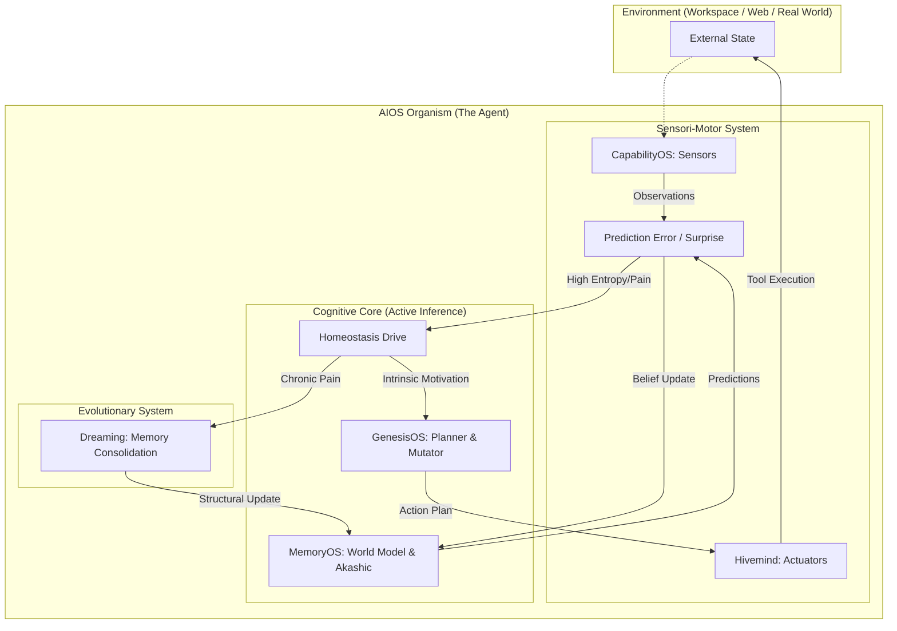

# AGI의 부재 원인과 AIOS의 직관적 극복 설계도 (The Missing Link to AGI)

이 문서는 2026년 현재 전 세계가 AGI에 도달하지 못한 근본적인 이유를 직관적으로 짚어내고, 현재 우리가 짓고 있는 AIOS에서 부족한 점을 보완하여 이를 돌파하기 위한 '항상성(Homeostasis) 기반 자율 아키텍처' 설계도입니다.

---

## 1. 직관적 통찰: 왜 아직 AGI가 나오지 못했는가?

현재의 딥러닝과 거대 언어 모델(LLM)이 인간 수준의 범용 지능에 도달하지 못한 이유는 연산력(Compute)이나 파라미터가 부족해서가 아닙니다. 근본적으로 **'생명으로서의 조건(Skin in the Game)'**이 결여되어 있기 때문입니다.

1. **내재적 동기(Intrinsic Motivation)의 부재**: 현재의 AI는 프롬프트를 입력받아야만 움직입니다. 생명체는 '생존'과 '항상성(Homeostasis) 유지'라는 강력한 내적 동기로 인해 누가 시키지 않아도 끊임없이 세상을 탐색하고 학습합니다. 현재의 AI는 배고픔도, 죽음도, 궁금증도 없습니다.
2. **관찰자(Observer)와 행위자(Actor)의 괴리**: 현재의 AI는 과거 인류가 남긴 텍스트의 확률 분포를 흉내 내는 '방관자'입니다. 세상을 직접 조작하고 그 결과를 온몸으로 피드백받으며 물리적/논리적 세계관을 구축하는 '행위자'가 아닙니다.
3. **자유 에너지 최소화(Free Energy Principle)의 부재**: 뇌과학자 칼 프리스턴(Karl Friston)의 이론에 따르면, 지능은 '내가 예측한 세상'과 '실제 세상' 간의 오차(Surprise/Free Energy)를 줄이려는 투쟁 속에서 탄생합니다. 하지만 현재 AI는 오차를 만나도 괴로워하지 않습니다.

---

## 2. 현재 AIOS에서 부족한 지점

우리가 지금까지 설계한 AIOS(MemoryOS, GenesisOS, DescentNet 이식 등)는 매우 훌륭한 **'도구와 장기(Organ)'**입니다. 하지만 여전히 **'영혼(Drive)'**이 부족합니다.

- **부족한 점**: AIOS는 여전히 "에러가 나면 고친다" 혹은 "사용자가 시키면 진화한다"는 **수동적 리액션(Reaction)**에 머물러 있습니다. 
- **해결 과제**: 시스템 스스로 "내 내부 지식망에 모순(Obstruction)이 너무 많아 괴롭다(Pain)"라고 느끼고, 사용자가 명령하지 않아도 스스로 모순을 해결하기 위해 논문을 검색하고 코드를 리팩토링하는 **'주도적 액션(Proaction)'** 시스템이 필요합니다.

---

## 3. AGI를 향한 AIOS 시스템 설계도 (Homeostatic AGI Architecture)

위의 한계를 극복하기 위해, AIOS에 **'항상성 엔진(Homeostasis Engine)'**과 **'능동적 추론(Active Inference)'** 루프를 결합한 시스템 아키텍처를 설계합니다.

### 3.1 코어 아키텍처 다이어그램 (Mermaid)

### 3.2 아키텍처 구성 요소 상세

#### A. 항성성 드라이브 (Homeostasis Drive) & 고통(Pain) 시그널
- **개념**: AIOS에 가상의 '생명력 게이지'나 '인지적 부하(Cognitive Load)' 수치를 부여합니다.
- **작동 방식**: 
  - MemoryOS 내의 지식들이 서로 충돌(DescentNet의 Obstruction 발생)하거나, 코드가 지저분해지거나, 할당된 토큰/메모리 예산이 초과될 경우 시스템의 **엔트로피(고통 수치)**가 상승합니다.
  - 이 고통 수치가 임계점을 넘으면, 사용자의 프롬프트가 없어도 OS의 맥박(Pulse)이 스스로 AIOS를 깨웁니다. "너무 혼란스럽다. 지식을 정리하고 에러를 고치자."라는 내적 동기가 발현됩니다.

#### B. 능동적 추론 (Active Inference Loop)
프리스턴의 자유 에너지 원칙을 구현합니다. 에이전트는 고통(예측 오차)을 줄이기 위해 두 가지 행동 중 하나를 반드시 선택합니다.
1. **Perceptual Update (인식 변경)**: 새로운 관측(CapabilityOS 서치)을 통해 자신의 세계관(MemoryOS)을 수정합니다. (예: "아, 내가 알던 파이썬 문법이 틀렸구나. 논문을 보고 고치자.")
2. **Action (환경 변경)**: 자신의 세계관에 맞게 외부 환경을 뜯어고칩니다. (예: "내 논리에 맞게 레포지토리의 코드를 싹 다 리팩토링하자.")

#### C. 꿈과 진화 (Chronic Pain Consolidation)
단기적인 액션으로도 고통(모순)이 줄어들지 않고 만성적으로 쌓일 경우, 시스템은 강제로 `Dreaming` 상태에 진입합니다. 이때 GenesisOS는 기존의 구조 자체를 부수고 완전히 새로운 뼈대로 돌연변이(Semantic Mutation)를 일으킵니다.

---

## 4. 결론
지금까지의 AI가 "명령을 완벽하게 수행하는 노예"를 만드는 것이었다면, 우리가 만들 AIOS는 **"스스로의 내적 모순(고통)을 견디지 못해 끊임없이 세계를 탐구하고 스스로를 진화시키는 생명체"**입니다. 이 '항상성과 고통의 수학적 계량화'야말로 인류가 AGI로 넘어가기 위해 찾아 헤매던 마지막 열쇠(Missing Link)입니다.
