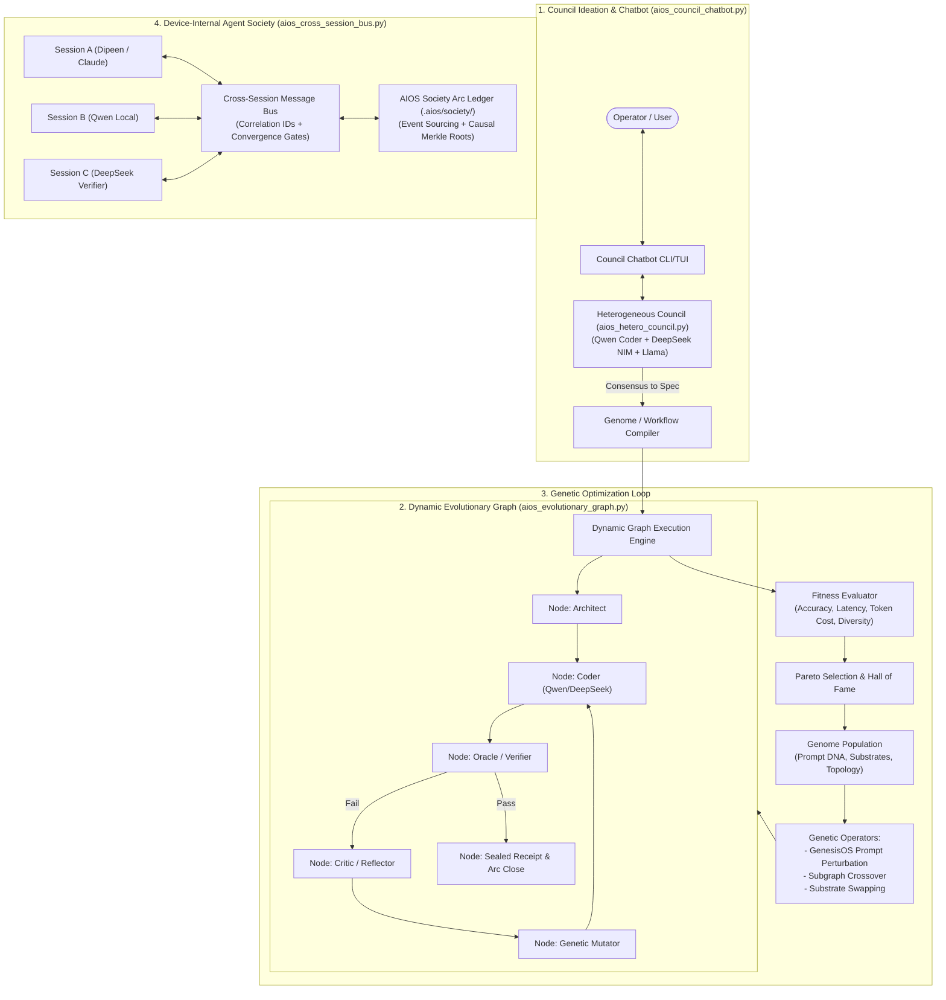

# AIOS Evolutionary Agent Society & Open-Source Council Loop

> **Schema**: `aios.evolutionary_society.v1`  
> **Integrations**: NVIDIA NIM API (DeepSeek-V4/Llama/Nemotron), Local Ollama (Qwen 2.5/3 Coder), Dipeen Control Plane, Claude Teams / UDS Cross-Session Bus, Merkle-Rooted Society Arcs.

---

## 1. Executive Summary & Problem Addressed

Existing agent frameworks suffer from three systemic limitations:
1. **Monocultural Failure**: Reliance on a single model weight distribution leads to shared blind spots.
2. **Static & Fragile Topologies**: Fixed turn loops or prompt templates cannot self-adapt when task complexity or domain shifts.
3. **Session Amnesia & Coordination Chaos**: Sub-agents lack persistent identity, correlation IDs for asynchronous queries, or semantic convergence criteria, causing runaway token burn or dropped context.

The **AIOS Evolutionary Society & Council Loop** upgrades AIOS from a fragmented prototype to an end-to-end, self-optimizing multi-agent operating organism running natively on the device.

---

## 2. Five Pillars Architecture



---

## 3. Core Modules & Implementation Details

### A. Heterogeneous Model Council (`scripts/aios_hetero_council.py`)
- **Substrate Layer**: Unifies local Ollama (`qwen3-coder:30b`, `deepseek-coder-v2:16b`) and NVIDIA NIM API (`deepseek-ai/deepseek-v4-flash-0731`, `meta/llama-3.1-8b-instruct`) with automatic fallback.
- **Deliberation Protocol**:
  1. *Blind Ideation*: Multi-perspective proposals without anchor bias.
  2. *Adversarial Cross-Critique*: Peer red-teaming identifying edge cases.
  3. *Effective Vote Metric ($N_{\text{eff}}$)*: Penalizes monocultural bias from same-model families.
  4. *Consensus Synthesis*: Compiles deliberation into actionable contracts.

### B. Dynamic Evolutionary Graph Engine (`scripts/aios_evolutionary_graph.py`)
- **Dynamic Directed Graph**: Nodes execute specific roles (`architect`, `coder`, `verifier`, `critic`, `mutator`), with dynamic edges evaluating test receipts and loop budgets.
- **Genetic Genome Specification**:
  - `prompt_dna`: Persona and heuristic prompt strings with variable mutation slots.
  - `substrate_map`: Dynamic assignment of model backends to graph nodes.
  - `topology_dna`: Active node routing and max repair thresholds.
- **Evolutionary Operators**:
  - *Mutation*: Prompt perturbation (GenesisOS analogy mutation), substrate swapping, hyperparameter tuning.
  - *Crossover*: Trait and subgraph splicing between elite parent genomes.
  - *Hall of Fame*: Immutable Pareto frontier ledger (`.aios/evolution/hall_of_fame.jsonl`).

### C. Cross-Session Message Bus (`scripts/aios_cross_session_bus.py`)
- **Correlation ID Tracking**: Eliminates out-of-order race conditions in multi-agent discussions.
- **Persistent Registry**: Tracks agent capabilities (`provider.ollama`, `role.coder`, `model.qwen`) and historical reputation.
- **Convergence Gate**: Terminates cyclic debates when semantic similarity plateau ($\ge 0.85$) is detected.
- **Society Arc Ledger**: Every message and event is appended to `.aios/society/` with Merkle root verification.

### D. Council Chatbot & Ideation Studio (`scripts/aios_council_chatbot.py`)
- **Interactive Slash Commands**:
  - `/ideate <topic>`: Brainstorms multi-model perspectives.
  - `/debate [topic]`: Executes adversarial peer critique.
  - `/compile`: Transforms council consensus into an executable `AgentGenome`.
  - `/run <goal>`: Runs the dynamic graph loop.
  - `/bus <to> <msg>`: Dispatches messages to other live sessions on the device.
  - `/inbox`: Inspects asynchronous agent messages.

---

## 4. Verification & Testing

Unit and integration test suite (`tests/test_aios_evolutionary_society.py`):
```bash
python3 -m unittest tests/test_aios_evolutionary_society.py
```
- Validates 8 test cases covering substrate querying, $N_{\text{eff}}$ calculation, graph state execution, genetic crossover/mutation, bus routing, and chatbot compilation.
