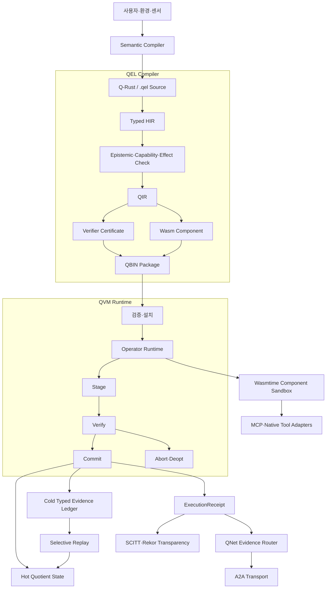
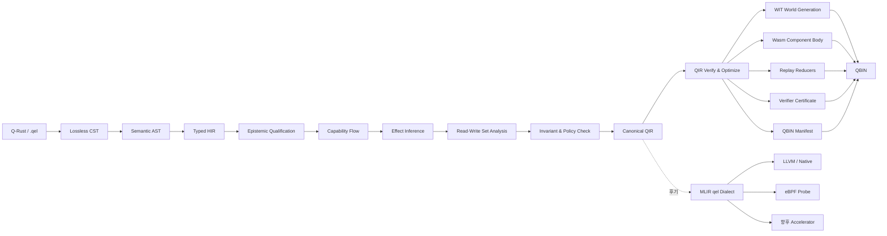
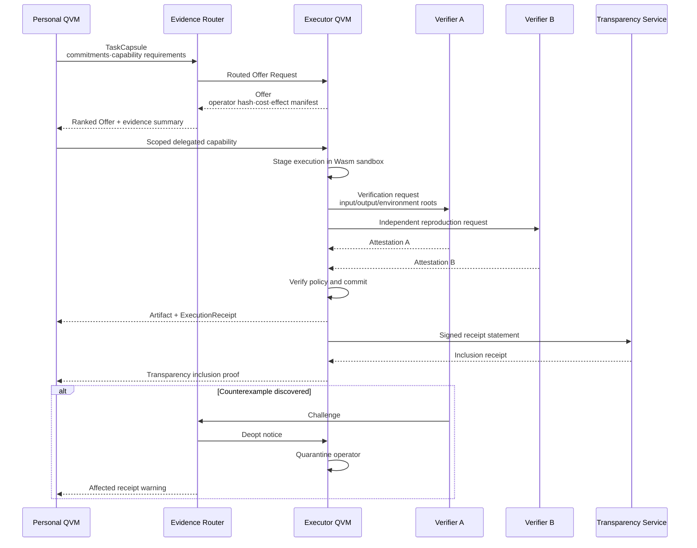
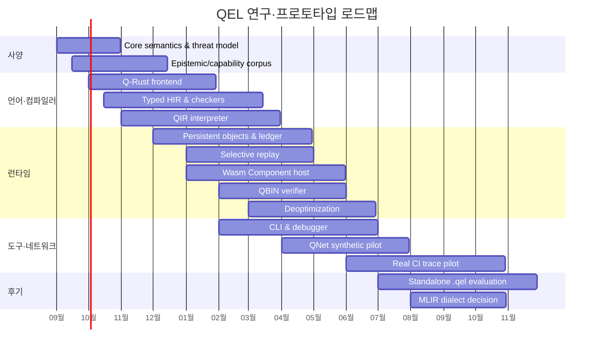

# QEL 기반 사양과 프로토타입 계획

## 경영 요약

QEL의 첫 버전은 범용 프로그래밍 언어도, “AI용 Solidity”도, 새로운 운영체제도 아니어야 한다. 가장 현실적이면서도 장기 확장성을 보존하는 정의는 다음이다.

\[
\boxed{
\text{QEL v0.1}
=
\text{검증 가능한 에이전트 상태전이를 작성하는 언어}
}
\]

QEL 프로그램은 단순히 값을 계산하지 않는다. 프로그램은 **어떤 상태를 읽고 쓸지, 어떤 권한을 소비할지, 어떤 외부 효과를 일으킬지, 어떤 증거로 결과를 검증할지, 실패하면 어떻게 중단·보상·비최적화할지**를 하나의 operator contract로 기술한다.

초기 토대는 다음 조합이 가장 타당하다.

| 계층 | 권고안 | 초기 선택의 이유 |
|---|---|---|
| 표면 언어 | Rust embedded DSL인 `Q-Rust` | 문법을 조기에 고정하지 않고 의미론을 실험 |
| 핵심 의미론 | Epistemic type + affine capability + effect row + transaction | 추측·권한·부작용·상태변경을 정적으로 분리 |
| 컴파일러 구현 | Rust | ownership, 생태계, Wasm 통합, 안전한 런타임 구현 |
| 초기 IR | Rust로 구현한 custom typed QIR | MLIR 도입 전 의미론을 빠르게 수정 |
| 후기 IR | MLIR QEL dialect | 다단계 lowering, 최적화, backend 확장 |
| 실행 형식 | WebAssembly Component + WIT | 언어 중립 인터페이스와 deny-by-default host boundary |
| 패키지 | proof-carrying `QBIN` | 코드·효과·스키마·검증 결과·출처를 함께 배포 |
| 로컬 저장 | immutable event ledger + versioned object + materialized quotient | hot state와 cold evidence 분리 |
| 투명성 | in-toto-style statement + Sigstore/Rekor 또는 SCITT | 서명·provenance·로그 포함 증명 |
| 네트워크 | A2A transport + MCP tool adapter + QNet evidence semantics | 기존 상호운용 계층을 재사용하고 신뢰 의미론만 추가 |
| 고신뢰 기반 | Linux/Wasmtime부터, seL4는 후기 | OS를 바꾸기 전에 병목과 TCB를 측정 |

Rust는 ownership 규칙을 컴파일러가 검사하고, Move는 `copy`, `drop`, `store`, `key` 능력으로 자원의 복제·폐기·저장 가능성을 통제한다. Koka는 함수 타입에 effect를 포함하고 effect handler를 조합 가능한 추상화로 제공한다. QEL은 이 세 계열의 아이디어를 각각 **런타임 안전성, 권한 자원, 외부 효과 추적**에 적용해야 한다. citeturn16search1turn16search0turn16search2

WebAssembly Component Model의 WIT world는 component가 제공하는 기능과 요구하는 기능을 import/export 계약으로 표현하며, component가 외부와 상호작용하는 경계를 명시한다. 따라서 QEL의 effect manifest를 실제 실행 경계에서 강제하기에 적합하다. citeturn14search1turn14search3turn14search17

QEL의 핵심 설계 전략은 **작은 안정 코어와 넓은 실험 확장부를 분리하는 것**이다.

```text
Ring 0 — Normative semantic kernel
  state, claim, capability, effect, operator, transaction, certificate

Ring 1 — Standard dialects
  memory, evidence, network, policy, workflow

Ring 2 — Experimental dialects
  probabilistic reasoning, robotics, scientific verification,
  subjective judgment, zero-knowledge disclosure, market settlement

Ring 3 — External adapters
  MCP, A2A, GitHub, CI, robot, browser, database, email
```

이 구조라면 아이디어 발산은 Ring 1–3에서 최대한 허용하면서도, Ring 0의 안전 조건은 쉽게 흔들리지 않는다.



**최소 실행 가능한 목표**는 독립 `.qel` 컴파일러가 아니다. 첫 번째 목표는 4~6개월 안에 다음 문장을 실제 코드로 증명하는 것이다.

> `Proposal<T>`는 검증 없이 persistent state에 기록할 수 없고, capability가 없는 외부 effect는 실행되지 않으며, 검증된 operator만 QVM에 설치되고, capability shock이 발생하면 cold ledger의 관련 부분만 재생할 수 있다.

이 목표를 달성하는 데 필요한 연구·개발량은 약 **17~24 person-months**, 3~4명의 집중 팀으로 약 5~7개월이 현실적인 초기 범위다. QNet 실사용 파일럿과 독립 언어·MLIR backend까지 포함한 연구 플랫폼은 약 **31~47 person-months** 규모로 보는 것이 타당하다. 이는 조직·기존 코드·실제 trace 가용성에 따라 달라지는 계획 추정치다.

## 설계 헌장과 언어 사양

**언어의 정체성**

QEL은 다음 다섯 가지가 결합된 언어다.

\[
\text{QEL}
=
\text{persistent state language}
+
\text{epistemic type language}
+
\text{capability language}
+
\text{effect language}
+
\text{verification contract language}
\]

C·Rust 계열의 일반 언어에서 함수는 대체로 “입력에서 출력을 계산하는 코드”다. QEL에서 operator는 다음 계약이다.

\[
O=
(R,W,C,E,P,V,K,D)
\]

- \(R\): 읽을 persistent object와 version
- \(W\): stage할 상태 delta
- \(C\): 필요한 capability와 소비·위임 방식
- \(E\): 가능한 외부 effect
- \(P\): 실행이 예상하는 결과
- \(V\): 결과를 판정할 verifier policy
- \(K\): commit 조건
- \(D\): abort, compensation, deoptimization 조건

**후보 언어와 기술의 역할 비교**

아래 평가는 “QEL 전체를 대체할 수 있는가”가 아니라 “QEL의 어느 층을 참고하거나 재사용할 것인가”를 기준으로 한다.

| 후보 | 강점 | QEL에서 채택할 부분 | 그대로 사용할 수 없는 이유 | 권고 역할 |
|---|---|---|---|---|
| Rust | ownership, borrowing, 강한 native 생태계 | compiler/runtime 구현, Q-Rust macro | epistemic state와 verifier independence가 first-class가 아님 | 주 구현 언어 |
| Move | 자원의 복제·폐기 능력을 타입 수준에서 제한 | affine/linear capability, persistent resource 감각 | blockchain global storage와 transaction에 강하게 결합 | 타입 설계 참고 |
| Solidity | persistent contract state, event, modifier, revert | operator contract의 가독성 | public/global chain, external reality rollback 부재 | 문법·UX 참고 |
| Koka | effect row와 effect handler | 선언된 effect, handler 기반 adapter | 지속 객체·권한·증거 모델이 없음 | 효과 체계 참고 |
| eBPF | load 전 verifier, 제한된 실행환경 | operator 설치 전 검증 절차 | 표현력과 실행 모델이 kernel packet/event 중심 | verifier 모델 참고 |
| MLIR | 사용자 정의 dialect, op/type/attribute, lowering | 후기 QIR dialect와 최적화 | 초기 C++·TableGen 비용과 조기 의미론 고정 위험 | 2단계 IR |
| Wasm Component | 언어 중립 binary, typed import/export | sandboxed operator body와 ABI | epistemic·capability 의미론 자체는 없음 | 실행 backend |
| seL4 | capability 기반 고신뢰 microkernel | 후기 고보증 deployment | 초기 연구에서 커널 전환 비용이 과도 | 장기 trusted substrate |

Move에서는 기본적으로 struct를 복제하거나 버릴 수 없고, 명시적인 ability가 해당 연산을 허용한다. Solidity contract는 persistent state variable과 function을 결합하지만, blockchain에 기록되는 데이터는 접근 제한자와 무관하게 공개될 수 있으며, 외부 호출과 reentrancy를 별도로 방어해야 한다. 따라서 QEL은 Move의 자원 제약은 채택하되 Solidity의 글로벌 공개 상태 모델은 채택하지 않는 편이 타당하다. citeturn16search4turn10search0turn10search13turn10search16

**상태 선언**

QEL의 `state`는 프로세스 내부 struct가 아니라 versioned persistent object다.

```qel
module ezmap.repo@0.1;

state Repo owned_by ControlRoot {
    id: ObjectId,
    head: Hash,
    branch: BranchName,
    test_status: TestStatus,
    open_tasks: u32,
    deployment: Option<DeploymentRef>,

    invariant {
        open_tasks >= 0;
        deployment.is_some()
            implies test_status == TestStatus::Passed;
    }
}
```

권장 상태 특성은 다음과 같다.

| 속성 | 의미 |
|---|---|
| Stable identity | process·host·model 변경과 독립적인 `ObjectId` |
| Immutable versions | 기존 version을 덮어쓰지 않고 새 version 생성 |
| Explicit owner | state를 통제하는 control-root 또는 policy |
| Schema version | migration과 replay를 위한 명시적 schema |
| Read/write set | operator가 접근할 필드를 정적으로 계산 |
| Evidence root | 상태를 정당화하는 evidence graph의 root |
| Materialized head | 일반 질의를 위한 현재 quotient state |

**Epistemic type system**

가장 중요한 규칙은 “추측, 관측, 증명, 운영상 수용된 사실”을 같은 타입으로 취급하지 않는 것이다.

```qel
Proposal<T>
Observation<T, Source>
Attested<T, VerifierPolicy>
Established<T, AcceptancePolicy>
Disputed<T, ChallengeSet>
Expired<T>
```

그러나 이를 단순한 상속 계층으로 만들면 안 된다.

```text
Proposal<T> <: Observation<T> <: Established<T>
```

와 같은 일반 subtype 관계를 허용하면 자동 coercion이 발생할 수 있다. QEL에서는 epistemic level 간 이동을 **증거를 소비하는 명시적 승격 연산**으로 정의해야 한다.

\[
\frac{
\Gamma\vdash x:\operatorname{Claim}\langle T,S\rangle
\qquad
\Gamma\vdash c:\operatorname{UpgradeCert}\langle S,S',T\rangle
}{
\Gamma\vdash \operatorname{promote}(x,c):
\operatorname{Claim}\langle T,S'\rangle
}
\]

예시는 다음과 같다.

```qel
let patch: Proposal<Patch> =
    model.generate<Patch>(issue);

repo.head <- patch.output_hash;
// compile error QEL-E102:
// Proposal<Patch> cannot justify a persistent state transition.
```

```qel
let run: Observation<TestResult, LocalSandbox> =
    pytest.run(patch);

let attestation: Attested<TestResult, IndependentCI> =
    verify run by independent_ci {
        require same_input_root;
        require same_environment_family;
        require passed;
    };

let accepted: Established<Patch, DeployPolicy> =
    promote patch using attestation;

repo.head <- accepted.output_hash;
```

`Attested<T>`도 곧바로 절대적 진실을 의미하지 않는다. 이것은 “지정된 verifier policy가 해당 claim을 승인했다”는 타입이다. 판정 정책이 바뀌거나 verifier가 손상되면 기존 값은 `Disputed<T>` 또는 `Expired<T>`로 전환될 수 있다.

W3C Verifiable Credentials도 issuer, holder, verifier 역할을 분리하고 claim과 검증 메커니즘을 결합하지만, QEL은 이 개념을 외부 credential뿐 아니라 모든 operator intermediate value에 적용한다. citeturn18search17

초기 v0.1에는 지나친 타입 폭발을 피하기 위해 내부 표현을 다음 하나로 통일하는 것이 좋다.

```qel
Claim<T, Grade, Provenance, Validity>
```

표면 언어의 `Proposal<T>`, `Observation<T, S>`, `Attested<T, P>`는 type alias로 제공한다.

```qel
type Proposal<T> =
    Claim<T, Proposed, Generated, Unbounded>;

type Observation<T, S> =
    Claim<T, Observed, Source<S>, Timestamped>;

type Attested<T, P> =
    Claim<T, AttestedGrade, Policy<P>, PolicyValidity<P>>;
```

**Capability와 affine resource**

Capability는 permission string이 아니라 소유권과 수명을 가진 typed resource다.

```qel
capability Deploy affine {
    object: ObjectId<Repo>,
    branch: BranchName,
    effects: set {
        git.write,
        ci.trigger,
        registry.publish
    },
    expires: Time,
    remaining_uses: u32,
    delegation_depth: u8,
    budget: Credits,
}
```

QEL의 cardinality는 다음 세 가지가 적합하다.

| 종류 | 규칙 | 사용 예 |
|---|---|---|
| `linear` | 정확히 한 번 소비해야 함 | 일회성 승인, escrow release |
| `affine` | 최대 한 번 소비 가능 | deploy·email 전송 권한 |
| `unrestricted` | 명시적으로 복제 가능 | 공개 read capability |

기본값은 `affine`가 안전하다. “사용하지 않아도 되는 권한”이 대부분이지만 무제한 복제는 피해야 하기 때문이다.

```qel
fn delegate(
    parent: &mut Deploy,
    scope: DeployScope,
    until: Time
) -> Deploy
requires {
    scope subset_of parent.scope;
    until <= parent.expires;
    parent.delegation_depth > 0;
}
ensures {
    result.authority subset_of old(parent.authority);
    result.delegation_depth
        == old(parent.delegation_depth) - 1;
}
```

위임은 항상 attenuation 관계를 만족해야 한다.

\[
c_{\text{child}}\preceq c_{\text{parent}}
\]

즉 child capability는 parent보다 더 많은 object, effect, 기간, 예산, 사용 횟수 또는 위임 깊이를 가질 수 없다.

**Effect system**

QEL은 함수·operator 타입에 effect row를 포함해야 한다.

```qel
fn inspect(repo: read Repo)
    -> Observation<RepoHealth, LocalProbe>
    ! {
        state.read(repo),
        fs.read(repo.workspace),
        process.exec("pytest", timeout = 120s),
        clock.monotonic
    }
```

Effect는 행동의 종류이고 capability는 그 행동을 수행할 권한이다.

```text
Effect:
  network.request("api.github.com")

Capability:
  특정 repository에 대해
  특정 endpoint를
  오늘 3회까지 호출할 권한
```

이 둘을 통합하면 권한 시스템이 지나치게 복잡해지고, 분리하면 정적 분석과 runtime enforcement를 독립적으로 개선할 수 있다.

Koka는 함수 타입을 인자·effect·결과로 표현하고 effect handler로 exception, async 같은 제어 추상화를 조합한다. QEL은 이 방향을 채택하되, v0.1에서는 multi-shot continuation이 linear capability를 복제하지 않도록 handler를 **one-shot 또는 capability-free region**으로 제한해야 한다. citeturn16search2turn16search10

권장 표준 effect family는 다음과 같다.

```text
state.read<Object>
state.stage<Object>
ledger.append<Event>
fs.read<PathScope>
fs.write<PathScope>
network.request<Origin>
process.exec<Tool>
model.infer<ModelClass>
secret.use<SecretId>
money.reserve<Currency>
money.commit<Currency>
physical.actuate<Device>
privacy.disclose<PredicateSet>
human.approval<Policy>
clock.read<ClockClass>
random.sample<Source>
```

특히 `privacy.disclose`를 effect로 취급해야 한다. 데이터 유출은 파일 write와 마찬가지로 관찰 가능한 외부 상태변화이기 때문이다.

**Operator contract**

```qel
operator deploy_patch(
    repo: write Repo,
    patch: Proposal<Patch>,
    cap: consume Deploy
) -> ExecutionReceipt<Deployment>
! {
    state.read(repo),
    state.stage(repo),
    fs.read(repo.workspace),
    process.exec("pytest"),
    network.request("github-api"),
    ledger.append(DeploymentEvent)
}
requires {
    cap.object == repo.id;
    cap.branch == repo.branch;
    now() < cap.expires;
    patch.base == repo.head;
}
reads {
    repo.head;
    repo.test_status;
}
writes {
    repo.head;
    repo.test_status;
    repo.deployment;
}
stage {
    let candidate =
        git.apply(repo.head, patch);

    let local_run:
        Observation<TestResult, LocalSandbox> =
        pytest.run(candidate);

    predict {
        local_run.passed;
        candidate.regressions == 0;
    }

    propose delta {
        repo.head = candidate.hash;
        repo.test_status = local_run.status;
    }
}
verify {
    let remote:
        Attested<TestResult, IndependentCI> =
        reproduce local_run
        by quorum {
            minimum = 2;
            distinct = control_root;
            reject_conflict_of_interest = true;
        };

    require remote.input_root == candidate.hash;
    require remote.passed;
}
commit {
    apply delta;
    emit DeploymentEvent {
        repo: repo.id,
        artifact: candidate.hash,
        evidence: remote.evidence_root,
    };
}
compensate on network.failure {
    registry.unpublish_if_idempotent(candidate.hash);
}
deopt on {
    Counterexample<Regression>;
    EnvironmentMismatch;
    CertificateExpired;
}
```

중요한 규칙은 `stage`, `verify`, `commit`의 분리다.

\[
\Sigma
\xrightarrow{\text{stage}}
(\Sigma,\Delta)
\xrightarrow{\text{verify}}
(\Sigma,\Delta,\pi)
\xrightarrow{\text{commit}}
\Sigma'
\]

외부 현실의 모든 effect를 transaction rollback으로 되돌릴 수 있다고 가정해서는 안 된다. 이메일 전송, 결제, 로봇 이동은 DB transaction처럼 원상복구되지 않는다. QEL은 이 경우 `compensate`, idempotency key, 사전 승인, escrow, delayed commit을 명시적으로 요구해야 한다.

**Quotient 선언**

QEL에서 quotient는 “과거를 압축하는 기능”이 아니라 **현재 capability 집합에서 구분해야 하는 상태 차이를 선언하는 기능**이다.

\[
h_1\sim_{\mathcal A}h_2
\iff
\forall a\in\mathcal A,\;
O(h_1,a)=O(h_2,a)
\]

```qel
quotient ActiveRepo
over evidence<RepoEvent>
for capabilities<RepoOperations>
{
    distinguish by {
        latest_head;
        latest_test_status;
        open_task_count;
        active_deploy_rights;
        unresolved_incidents;
    }

    merge when {
        summaries_equal;
        no_retained_constraint_distinguishes;
        certificate = ConservativeMerge;
    }

    refine on {
        Counterexample;
        NewCapabilityDependency;
        InvariantViolation;
        SchemaMigration;
    }

    retain evidence {
        SecurityIncident forever;
        UserConstraint forever;
        DeploymentEvent for 7y;
        TestRun indexed by [repo_id, passed, environment];
    }
}
```

v0.1에서는 `future_equivalent`를 자동 판정하지 않는 것이 안전하다. 일반적인 미래 행동 동치성은 계산 불가능하거나 capability 변화에 따라 깨질 수 있기 때문이다. 초기 구현은 다음 세 방식만 허용하는 것이 좋다.

1. 개발자가 작성한 reducer가 동일 summary를 생성한다.
2. 제한된 capability set에 대한 equivalence test가 통과한다.
3. 명시적인 merge certificate가 존재한다.

**Memory declaration**

```qel
memory RepoMemory
from ledger<RepoEvent>
{
    hot head: Hash =
        latest(StageCommitted).artifact;

    hot test_status: TestStatus =
        latest(TestCompleted).status;

    hot open_tasks: u32 =
        count(TaskOpened) - count(TaskClosed);

    hot historical_failure: Optional<bool> =
        unmaterialized;

    index TestCompleted by {
        repo_id,
        status,
        environment_hash,
        timestamp
    }

    replay HistoricalFailureAnalysis {
        depends_on {
            TestCompleted(repo_id, status);
        }

        reduce(event, state) {
            state.failed_before |=
                event.status == Failed;
        }
    }

    privacy {
        raw_prompt local_only;
        user_identity local_only;
        receipt_export commitments_only;
    }
}
```

새 capability가 `historical_failure`를 요구하면 QVM은 `TestCompleted` dependency만 replay한다. 전체 자연어 대화나 모든 repository event를 다시 읽지 않는다.

## 컴파일러·QIR·QBIN 토대

**구현 순서**

MLIR은 custom dialect로 operation, type, attribute를 정의하고 dialect conversion을 통해 고수준 operation을 다른 target operation으로 낮출 수 있다. 그러나 초기부터 MLIR에 종속되면 QEL 의미론을 수정할 때 C++·TableGen·lowering 패스까지 함께 변경해야 한다. 따라서 첫 단계는 Rust custom QIR, 두 번째 단계는 MLIR dialect가 적합하다. citeturn14search0turn14search12turn14search24



**Frontend 단계**

| 단계 | 산출물 | 반드시 보존할 정보 |
|---|---|---|
| Lexer/parser | Lossless CST | 주석, 공백, source span, 오류 복구 |
| AST lowering | Semantic AST | 선언, 패턴, block 구조 |
| Name resolution | Resolved AST | module, schema, effect, verifier identity |
| Typed HIR | 정규화된 type graph | epistemic grade, capability cardinality |
| Effect inference | effect row | 직접·간접 effect와 disclosure |
| Capability flow | linear/affine flow graph | move, borrow, consume, delegate |
| State analysis | read/write set | object, field, version requirement |
| Contract analysis | operator graph | stage·verify·commit·deopt |
| QIR generation | canonical executable IR | 모든 effect·evidence·state edge |

초기 parser에는 `chumsky`, lossless syntax tree에는 `rowan`, incremental compiler query에는 `salsa`가 적합하다. Chumsky는 error recovery를 포함한 Rust parser combinator이고, Rowan은 lossless syntax tree를 제공하며, Salsa는 입력 변경에 따른 incremental recomputation을 지원한다. citeturn17search0turn17search9turn17search2

**Typed HIR**

HIR에서는 표면 문법의 다양성을 줄이고 모든 상태변경을 명시적인 형태로 정규화한다.

```text
Surface:
    repo.head <- artifact.hash

HIR:
    StageWrite {
        object: repo.id,
        expected_version: repo.version,
        field: Repo::head,
        value: artifact.hash,
        justification: evidence_var,
        capability: deploy_cap,
    }
```

HIR의 핵심 노드는 다음과 같다.

```text
HirClaim<T, Grade>
HirCapability<Class, Cardinality, Scope>
HirEffect<Kind, Scope>
HirStateRef<Object, VersionConstraint, AccessMode>
HirStageDelta
HirVerificationPolicy
HirEvidenceEdge
HirCommit
HirCompensation
HirDeoptTrigger
HirReplayDependency
```

**Epistemic type checker**

타입 검사기는 최소한 다음 오류를 잡아야 한다.

| 오류 코드 | 차단 대상 |
|---|---|
| `QEL-E101` | `Proposal<T>`를 established value로 사용 |
| `QEL-E102` | evidence 없이 persistent write |
| `QEL-E103` | 만료·논쟁 상태 claim 사용 |
| `QEL-E104` | verifier policy와 attestation policy 불일치 |
| `QEL-E105` | 자기검증을 독립 attestation으로 계산 |
| `QEL-E106` | evidence subject hash와 적용 대상 불일치 |
| `QEL-E107` | schema 또는 environment mismatch |
| `QEL-E108` | declassified되지 않은 private claim export |

**Capability checker**

Capability checker는 일반 ownership checker보다 넓은 flow를 추적한다.

```text
creation
→ ownership
→ borrow
→ split/attenuate
→ delegate
→ reserve
→ consume
→ revoke/expire
```

다음 invariant가 필요하다.

\[
\operatorname{authority}(c')
\subseteq
\operatorname{authority}(c)
\]

\[
\sum_i\operatorname{uses}(c_i)
\le
\operatorname{uses}(c)
\]

\[
\operatorname{expiry}(c_i)
\le
\operatorname{expiry}(c)
\]

비동기 suspension을 넘는 affine capability는 runtime에 pinning하거나 continuation을 one-shot으로 제한해야 한다. 그렇지 않으면 continuation 재개가 권한 복제를 유발할 수 있다.

**Effect checker**

Effect checker는 다음 세 층을 함께 계산한다.

```text
Declared effects
    programmer/operator가 명시

Inferred effects
    호출 그래프와 adapter에서 추론

Host effects
    WIT world가 실제 제공
```

유효한 QBIN은 다음 관계를 만족해야 한다.

\[
E_{\text{inferred}}
\subseteq
E_{\text{declared}}
\subseteq
E_{\text{host-allowed}}
\]

그리고 각 권한 필요 effect에 대해 대응 capability가 있어야 한다.

\[
\forall e\in E_{\text{privileged}},
\exists c:\operatorname{authorizes}(c,e)
\]

**QIR 설계**

QIR은 일반 SSA IR과 persistent object transition IR을 결합한다.

```text
Ephemeral values:
    SSA value

Persistent values:
    ObjectId + VersionId + SchemaId

Effects:
    ordered effect token

Capabilities:
    affine SSA token

Evidence:
    typed certificate reference

State changes:
    staged delta, not raw store
```

권장 core operation은 다음과 같다.

| QIR operation | 의미 |
|---|---|
| `q.object.open` | persistent object의 특정 version 열기 |
| `q.object.read` | object field 읽기 |
| `q.delta.begin` | staged delta 생성 |
| `q.delta.write` | state 변경 후보 추가 |
| `q.cap.require` | capability scope 확인 |
| `q.cap.borrow` | 일시적 권한 대여 |
| `q.cap.consume` | affine/linear capability 소비 |
| `q.cap.delegate` | 축소된 capability 생성 |
| `q.effect.invoke` | host effect 호출 |
| `q.claim.propose` | proposal 생성 |
| `q.claim.observe` | source-bound observation 생성 |
| `q.evidence.attach` | claim과 evidence 연결 |
| `q.verify.run` | verifier policy 실행 |
| `q.claim.promote` | certificate를 소비해 epistemic grade 승격 |
| `q.commit` | delta와 capability 소비를 원자적으로 확정 |
| `q.abort` | staged delta 폐기 |
| `q.compensate` | 이미 발생한 외부 effect 보상 시도 |
| `q.fork` | counterfactual state branch |
| `q.join` | branch 결과 비교·병합 |
| `q.replay.select` | dependency 기반 event replay |
| `q.operator.install` | 검증된 operator 설치 |
| `q.operator.deopt` | compiled operator 비활성화 |
| `q.receipt.emit` | execution receipt 생성 |

예시 QIR은 다음과 같다.

```mlir
q.operator @deploy_patch(
    %repo: !q.object<Repo, write>,
    %patch: !q.claim<Patch, proposed>,
    %cap: !q.cap<Deploy, affine>
) -> !q.receipt<Deployment> {
    %v = q.object.version %repo
    q.cap.require %cap {
        object = %repo,
        effect = #q.effect<git.write>
    }

    %delta = q.delta.begin %repo expected %v

    %candidate = q.effect.invoke @git_apply(%patch)
        using %cap
        : (...) -> !q.claim<Artifact, observed>

    %test = q.effect.invoke @pytest(%candidate)
        : (...) -> !q.claim<TestResult, observed>

    %cert = q.verify.run @independent_ci(%test)
        : (...) -> !q.cert<TestResult, IndependentCI>

    %accepted = q.claim.promote %candidate using %cert
        : !q.claim<Artifact, observed>
       -> !q.claim<Artifact, established>

    q.delta.write %delta[Repo::head] = %accepted.hash
    %receipt = q.commit %delta consume %cap evidence %cert

    q.return %receipt
}
```

**Verifier certificate**

Verifier certificate는 “안전하다”라는 포괄적 boolean이 아니다. 무엇을 검사했고 무엇을 가정했는지를 기계가 읽을 수 있어야 한다.

```text
VerifierCertificate
├─ source_hash
├─ qir_hash
├─ compiler_version
├─ language_spec_version
├─ checks[]
│  ├─ type_safety
│  ├─ epistemic_flow
│  ├─ capability_conservation
│  ├─ effect_subset
│  ├─ read_write_conflicts
│  ├─ invariant_preservation
│  └─ resource_bounds
├─ proof_harnesses[]
├─ differential_tests[]
├─ counterexamples_checked[]
├─ assumptions[]
│  ├─ host_adapter_version
│  ├─ oracle_identity
│  ├─ clock_model
│  └─ network_model
├─ unsupported_features[]
├─ validity_window
└─ signer
```

eBPF verifier는 프로그램을 load하기 전에 register와 memory 상태, helper argument 등을 분석해 허용 여부를 결정한다. QEL도 “설치 전 verifier” 모델을 채택하되, eBPF보다 훨씬 풍부한 epistemic·effect·capability certificate를 생성해야 한다. citeturn0search2turn0search8

**QBIN 패키지**

QBIN은 단일 executable이 아니라 검증 가능한 배포 bundle이다.

```yaml
qbin:
  manifest-version: "0.1"
  package:
    name: "ezmap.deploy-patch"
    version: "0.1.0"
    spec-version: "qel-0.1"
    source-root: "blake3:..."
    qir-root: "blake3:..."

  component:
    wasm: "components/deploy_patch.wasm"
    wit-world: "qel:operator/deploy-patch@0.1.0"
    entrypoint: "run"
    deterministic-profile: "strict-v1"

  state:
    reads:
      - object: "Repo"
        fields: ["head", "branch", "test_status"]
    writes:
      - object: "Repo"
        fields: ["head", "test_status", "deployment"]
    expected-schema:
      Repo: "0.3"

  effects:
    declared:
      - kind: "fs.read"
        scope: "/workspace/**"
      - kind: "process.exec"
        tool: "pytest"
        timeout-ms: 120000
      - kind: "network.request"
        origin: "github-api"
      - kind: "ledger.append"
        event: "DeploymentEvent"

  capabilities:
    consumes:
      - class: "Deploy"
        cardinality: "affine"
    borrows:
      - class: "RepoRead"

  verification:
    certificate: "certificates/verifier.cbor"
    policy: "independent-ci-v1"
    minimum-distinct-control-roots: 2
    expires-at: "2026-12-31T00:00:00Z"

  replay:
    reducer: "reducers/repo_memory.wasm"
    dependencies:
      - "StageCommitted"
      - "TestCompleted"
      - "DeploymentEvent"

  deoptimization:
    fallback-operator: "qel.core.primitive-deploy@0.1"
    triggers:
      - "counterexample"
      - "environment-mismatch"
      - "certificate-expired"

  provenance:
    statement: "provenance/intoto-statement.json"
    signatures:
      - "signatures/cosign.bundle"
    transparency-receipts:
      - "receipts/scitt.cbor"

  limits:
    fuel: 10000000
    memory-bytes: 134217728
    wall-time-ms: 180000
    output-bytes: 10485760
```

WIT는 component의 interface와 world를 정의하지만 내부 behavior를 정의하지 않는다. 따라서 WIT는 ABI, QIR은 의미론, QBIN manifest는 정책과 provenance를 담당하도록 역할을 분리해야 한다. citeturn14search3turn14search20

QBIN은 OCI registry에 저장할 수 있다. WebAssembly component와 WIT package를 OCI registry로 배포하는 도구가 이미 제공되므로, 별도 binary registry를 처음부터 만들 필요는 없다. citeturn14search23

## QVM 런타임과 지속 상태

**QVM 상태 모델**

QVM의 전체 runtime 상태를 다음처럼 정의할 수 있다.

\[
\Sigma=
(O,H,L,C,R,P,V,N)
\]

- \(O\): versioned persistent objects
- \(H\): 현재 materialized quotient heads
- \(L\): append-only typed evidence ledger
- \(C\): active capabilities
- \(R\): installed operator registry
- \(P\): policy·verifier policy
- \(V\): verifier certificate cache
- \(N\): pending network·external effects

QVM의 정상 transition은 다음과 같다.

\[
\Sigma
\xrightarrow{\text{resolve}}
\Sigma_r
\xrightarrow{\text{stage}}
(\Sigma_r,\Delta)
\xrightarrow{\text{verify}}
(\Sigma_r,\Delta,\pi)
\xrightarrow{\text{commit}}
\Sigma'
\]

실패 시:

\[
(\Sigma_r,\Delta)
\xrightarrow{\text{abort}}
\Sigma_r
\]

이미 외부 effect가 발생했다면:

\[
(\Sigma_r,\Delta,E)
\xrightarrow{\text{compensate}}
(\Sigma_r,E')
\]

`compensate`는 반드시 성공하는 inverse가 아니다. 따라서 receipt에는 보상 성공 여부와 unresolved external state를 남겨야 한다.

**Persistent versioned object**

권장 저장 구조는 다음 세 층이다.

```text
Object versions
  ObjectId → Version DAG

Event ledger
  EventId → typed immutable event

Materialized heads
  ObjectId + ViewId → current quotient state
```

각 commit은 원자적으로 다음을 기록한다.

```text
previous object version
new object version
staged delta
consumed capabilities
evidence roots
operator hash
schema version
logical time
external effect status
receipt root
```

초기 로컬 저장에는 pure-Rust embedded ACID KV인 `redb`가 적합하다. redb는 copy-on-write B-tree, MVCC, crash-safe transaction과 savepoint를 제공한다. 다중 노드 registry나 분석 환경은 PostgreSQL과 SQLx를 병행하는 편이 운영상 유리하다. citeturn17search3

**Selective replay**

각 materialized view와 capability는 필요한 event dependency를 선언한다.

```qel
capability HistoricalFailureAnalysis {
    requires history {
        TestCompleted.repo_id;
        TestCompleted.status;
        TestCompleted.timestamp;
    }
}
```

컴파일러는 이를 replay plan으로 낮춘다.

```text
Capability dependency
→ event type index
→ object filter
→ schema migration
→ deterministic reducer
→ new materialized field
→ replay certificate
```

Replay 결과에는 최소한 다음 검사가 필요하다.

- 동일 event 순서에서 동일 결과가 나오는가
- schema migration이 deterministic한가
- 누락된 event range가 없는가
- reducer hash가 기록됐는가
- output이 full replay와 같은가
- privacy policy가 replay read를 허용하는가

**Wasm component execution**

QVM은 operator body를 Wasm Component로 실행하고, 외부 effect는 모두 host import로만 제공한다.

```wit
package qel:operator@0.1.0;

interface state {
    resource object-handle;
    read-field: func(
        object: borrow<object-handle>,
        field: string
    ) -> result<list<u8>, state-error>;

    stage-field: func(
        object: borrow<object-handle>,
        field: string,
        value: list<u8>
    ) -> result<_, state-error>;
}

interface effects {
    exec-tool: func(
        capability: capability-handle,
        tool: string,
        input: list<u8>
    ) -> result<observation, effect-error>;
}

world operator {
    import state;
    import effects;
    import verification;
    export run;
}
```

Wasm Component의 world는 import와 export의 엄격한 경계를 정의하고, component는 공유 메모리가 아니라 interface를 통해 상호작용한다. 따라서 QVM이 제공하지 않은 filesystem, network, clock, random, secret interface에는 operator가 접근할 수 없다. citeturn14search1turn14search17

초기 Wasmtime host는 다음을 강제해야 한다.

| 통제 | 구현 |
|---|---|
| CPU | fuel 또는 epoch interruption |
| 메모리 | per-component memory limit |
| 시간 | host-provided monotonic deadline |
| 파일 | preopened virtual workspace만 제공 |
| 네트워크 | origin-aware proxy capability |
| random | deterministic seed 또는 explicit entropy capability |
| clock | logical clock와 wall-clock 분리 |
| secret | opaque secret handle, raw export 금지 |
| output | size·schema·content policy 제한 |
| recursion | call depth와 task depth 제한 |

**Verifier harness**

검증은 한 가지 도구로 끝내지 않는다.

```text
Static checks
  type, capability, effects, read/write, schema

Reference interpretation
  primitive QIR interpreter

Differential execution
  optimized operator vs primitive operator

Property-based testing
  arbitrary states and event sequences

Model checking
  bounded critical invariants

Adversarial generation
  LLM/fuzzer-generated counterexamples

Runtime monitors
  guard, environment, output, effect checks
```

Kani는 Rust 코드를 model checking으로 분석하고 proof harness와 concrete counterexample playback을 지원하므로 capability conservation, commit atomicity, version monotonicity 같은 제한된 runtime invariant에 적합하다. 다만 지원하지 않는 Rust 기능이나 bounded unwinding에 따른 한계를 certificate에 명시해야 한다. citeturn18search1turn18search13turn18search18

**Deoptimization**

Deoptimization은 오류 처리 기능이 아니라 QEL의 학습 안전성 핵심이다.

```text
Trigger
  guard violation
  counterexample
  environment drift
  verifier revocation
  certificate expiry
  schema migration
  distribution shift

Action
  operator admission 중지
  진행 중 task 격리
  primitive/reference operator로 fallback
  영향받은 receipt와 state 계산
  selective replay
  challenge/deopt notice 전파
  수정된 operator 재검증
```

operator 상태는 최소한 다음을 가져야 한다.

```text
Candidate
Verified
Installed
Quarantined
Deoptimized
Revoked
Superseded
```

counterexample이 발생했다고 모든 과거 결과를 즉시 폐기해서는 안 된다. counterexample의 scope를 environment, input class, operator version, verifier policy에 따라 계산하고, 영향을 받는 receipt만 `Disputed`로 전환해야 한다.

**OS로 내려갈 시점**

초기 QVM은 Linux와 Wasmtime 위에서 작동해야 한다. 다음 비용이 실제 workload에서 지배적일 때만 OS 또는 microkernel 수준으로 내린다.

- persistent object를 DB·process memory 사이에서 반복 복사하는 비용
- semantic transaction을 여러 subsystem에서 조정하는 비용
- capability enforcement가 userspace adapter에서 우회되는 문제
- deterministic replay를 방해하는 host nondeterminism
- 프로세스보다 오래 지속되는 identity·object handle 복구
- 고위험 side effect의 격리 요구

seL4는 강한 보안 경계와 capability 기반 시스템의 장기 후보지만, QEL 의미론이 안정되기 전에 채택하면 커널·driver·tooling 문제가 언어 연구를 압도한다. seL4는 포괄적 formal verification을 주요 특성으로 하는 고보증 microkernel이므로, 안전 중요 로봇·의료·방산 deployment 단계에서 별도 backend로 검토하는 것이 적절하다. citeturn16search28turn16search18

## 보안·거버넌스와 QNet 생태계

**신뢰 경계**

QEL 시스템은 다음 세 평면을 분리해야 한다.

```text
Generative plane
  LLM, search, synthesis, user code
  → proposal만 생성

Verification plane
  compiler, policy, oracle, challenge
  → certificate 생성

Commit plane
  QVM, capability store, persistent state
  → certificate와 authority가 있을 때만 상태변경
```

어떤 LLM도 직접 다음 권한을 가져서는 안 된다.

```text
capability 발급
operator 최종 승인
verifier independence 선언
persistent state 직접 수정
transparency record 삭제
자신의 권한 scope 확대
```

**Control-root 모델**

`ControlRoot`는 “한 사람을 전 세계적으로 증명하는 ID”가 아니다. 여러 identity·endpoint가 동일한 통제 아래 있는지를 계산하기 위한 scoped security principal이다.

```text
ControlRoot
├─ passkey / account key
├─ device attestation
├─ organization credential
├─ recovery relationship
├─ payment or contractual principal
├─ delegated agent identities
└─ disclosed conflict relationships
```

한 사람이나 조직은 역할별로 여러 root를 가질 수 있다. 다만 다음은 독립 증거로 계산하면 안 된다.

```text
동일 root의 requester와 verifier
동일 organization이 통제하는 두 verifier
동일 payment beneficiary의 Sybil executor
동일 model operator가 만든 여러 endpoint
```

W3C VC는 issuer–holder–verifier와 선택적 presentation에 필요한 범용 claim 교환 모델을 제공하므로, organization·device·role credential에 활용할 수 있다. 그러나 VC 하나가 실제 control independence를 자동으로 증명하는 것은 아니므로 관계 그래프와 conflict disclosure가 추가되어야 한다. citeturn18search17

**Verifier independence**

독립성은 단순히 서로 다른 public key라는 의미가 아니다.

\[
I(v_i,v_j)=
f(
\text{control roots},
\text{organization},
\text{model lineage},
\text{infrastructure},
\text{financial interest},
\text{shared evidence}
)
\]

초기 verifier policy는 다음 조건을 지원해야 한다.

```qel
verify by quorum {
    minimum = 2;
    distinct = control_root;
    disallow_same_org = true;
    disallow_executor_beneficiary = true;
    max_shared_infrastructure_score = 0.5;
    require_one_deterministic_oracle = true;
}
```

“독립성 점수”는 완전한 객관적 진실이 아니므로 receipt에 정책 버전과 계산 근거를 함께 기록해야 한다.

**Provenance와 transparency**

in-toto Statement는 artifact subject와 predicate type을 결합하고, test-result predicate는 소프트웨어 test 결과를 표현하는 공통 schema를 제공한다. QEL receipt와 verifier result를 완전히 새 형식으로 만들기보다 이 구조를 일반화하는 편이 상호운용성과 감사성에 유리하다. citeturn18search4turn18search2

SCITT의 RFC 9943은 2026년 6월 공개된 signed statement 등록·감사를 위한 transparency architecture를 정의하며, 여러 transparency service가 공통 형식과 protocol을 사용할 수 있게 한다. Sigstore Rekor는 append-only 검증 가능한 로그에 signed metadata를 기록하고 inclusion proof와 consistency audit를 제공한다. citeturn15search0turn15search1

그러나 서명과 transparency inclusion은 다음만 증명한다.

```text
특정 principal이 특정 statement를 발행했다
statement가 특정 시점까지 로그에 포함됐다
로그 entry가 이후 조용히 변경되지 않았다
```

다음을 증명하지는 않는다.

```text
statement의 의미가 참이다
verifier가 독립적이다
측정 도구가 정확하다
실행환경이 조작되지 않았다
subjective 결과가 보편적으로 옳다
```

따라서 QNet의 trust score는 receipt 개수나 signature 수가 아니라 **task-specific verifier quality, control-root independence, reproducibility, challenge history**에서 파생해야 한다.

개인 데이터는 transparency log에 직접 기록하지 않는다. 로그에는 hash, commitment, schema ID, 최소 routing metadata만 등록하고, 원문 evidence는 로컬 또는 접근제어 저장소에 둔다.

**Capability delegation과 revocation**

위임 certificate에는 다음이 필요하다.

```text
parent capability root
child capability root
delegator and delegatee
scope reduction
effect reduction
budget reduction
expiry
remaining delegation depth
revocation endpoint
purpose binding
task binding
signature
transparency receipt
```

QVM은 실행 직전에 expiry와 revocation을 확인한다. 네트워크 단절 시 정책은 effect 위험도에 따라 나눈다.

| 위험 등급 | 단절 시 정책 |
|---|---|
| Read-only public | cached credential 허용 |
| Private read | 짧은 offline grace |
| Reversible write | local stage만 허용 |
| Irreversible external effect | 온라인 revocation check 필수 |
| 결제·물리 작동 | 온라인 check와 인간 승인 요구 가능 |

**Sandboxing**

한 층의 sandbox만으로는 충분하지 않다.

```text
Language layer
  epistemic/capability/effect checker

Package layer
  signed QBIN, dependency policy

VM layer
  Wasm imports, fuel, memory limits

OS layer
  process isolation, namespace, seccomp/Landlock

Service layer
  network proxy, secret broker, tool allowlist

Governance layer
  verifier, challenge, transparency, revocation
```

eBPF verifier가 load 전 프로그램을 검사하더라도 verifier가 허용한 helper와 context가 안전성의 경계를 결정하는 것처럼, QEL도 host adapter 자체를 trusted computing base로 취급해야 한다. citeturn0search2

**QNet 객체**

| 객체 | 수명 | 주요 내용 |
|---|---|---|
| `CapabilityAdvert` | 단기 | 자기신고 capability, endpoint, 가격, 제약 |
| `TaskCapsule` | 단기 | 목표, commitment, 필요한 capability, privacy budget |
| `Offer` | 단기 | executor 조건, 예상 비용, verifier proposal |
| `ExecutionReceipt` | 장기 | 실행·입력·출력·environment·verdict commitment |
| `Challenge` | 장기 | counterexample, reproduction, dispute |
| `DeoptNotice` | 장기 | operator·receipt 영향 범위와 fallback |
| `CapabilityEvidence` | 장기 | capability별 누적 독립 실행 증거 |
| `OperatorPackage` | 버전형 | QBIN, provenance, certificate |
| `DelegationReceipt` | 권한 수명 | capability 위임·축소·취소 |

A2A v1은 agent 간 message와 task, artifact 교환을 위한 protocol schema를 제공하고, normative Protocol Buffers 정의와 JSON schema를 제공한다. QEL은 A2A를 대체하기보다 `TaskCapsule`, receipt commitment, challenge metadata를 A2A extension 또는 artifact로 운반하는 것이 적절하다. citeturn15search2turn15search18turn15search27

2026년 7월 28일 MCP specification은 stateless core와 formal extension framework를 도입했고, MCP tool은 외부 API·데이터베이스·계산 기능을 모델에 노출한다. QVM에서는 MCP를 operator 내부 tool adapter로 사용하되, MCP의 transport authorization과 QEL의 semantic capability를 동일시하면 안 된다. MCP token이 유효하더라도 QEL capability가 허용하지 않는 effect는 차단해야 한다. citeturn15search3turn15search13turn15search28



**Evidence router**

라우팅은 단일 reputation 점수가 아니라 다목적 의사결정이어야 한다.

\[
\begin{aligned}
Score(r,t)=&
\;\mathbb E[U(r,t)]
+\alpha\,Exploration(r,t)\\
&-\beta\,Price(r,t)
-\gamma\,VerificationCost(r,t)\\
&-\delta\,PrivacyLeakage(r,t)
-\eta\,Concentration(r)\\
&-\rho\,VerifierCorrelation(r,t)
-\kappa\,IrreversibilityRisk(t)
\end{aligned}
\]

라우터가 참조할 증거 단위는 global reputation이 아니라 다음 context tuple이어야 한다.

\[
(\text{capability},
\text{task class},
\text{environment},
\text{operator version},
\text{verifier policy})
\]

Python test task에서 높은 성공률을 보인 executor가 로봇 actuator task에서도 신뢰받아서는 안 된다.

**Newcomer lane**

증거 기반 라우팅은 초기 task를 받은 incumbent에게 receipt가 집중되는 자기강화 구조를 만든다. 이를 방지하기 위해 일부 저위험·객관적 검증 가능 task를 newcomer에게 배정한다.

```text
Newcomer eligibility
  독립 receipt가 아직 적음
  capability advert와 task가 일치
  동일 control-root의 다른 alias가 아님
  객관적 verifier가 존재
  irreversible effect가 없음
  bounded budget과 sandbox 가능
```

초기 탐색률은 고정된 경제 법칙이 아니라 실험 parameter다. 5~10% 정도의 audited newcomer lane을 시작점으로 두고 성공률, false acceptance, verifier 비용, 수익 집중도를 함께 측정하는 것이 타당하다.

**Sybil과 집중 방어**

| 공격·실패 | 방어 |
|---|---|
| 여러 alias로 후보 점유 | identity가 아니라 control-root별 rate limit |
| 자기 task·자기 검증 | requester/executor/verifier root 분리 |
| receipt farming | receipt 생성 자체에는 보상 없음 |
| 저가 악성 입찰 | expected loss와 verifier 비용 포함 |
| verifier cartel | correlation graph와 무작위 challenge |
| incumbent 독점 | UCB/Thompson exploration, newcomer lane |
| 수익 집중 | concentration penalty와 capacity-aware routing |
| operator monoculture | 구현·model·infrastructure diversity bonus |
| 평가 오염 | hidden benchmark와 delayed challenge |
| subjective task 조작 | 사용자별 preference model 또는 panel |

Objective task와 subjective task는 settlement policy를 분리해야 한다.

```text
Deterministic software test
  executable oracle

Stochastic experiment
  multi-seed reproduction

Scientific claim
  preregistration + replication + challenge

Forecast
  delayed outcome settlement

Personal preference
  사용자 local QVM feedback

Collective judgment
  diverse panel, market, deliberation

Safety-critical action
  formal invariant + hardware attestation + human approval
```

## 개발자 경험과 오픈소스 스택

**Q-Rust에서 독립 `.qel`까지**

처음부터 새 syntax를 확정하면 연구 질문이 언어 parser와 IDE 문제로 바뀐다. 권장 순서는 다음이다.

```text
Q-Rust procedural macros
    ↓
20~30개 실제 operator 작성
    ↓
공통 의미론과 반복 문법 추출
    ↓
Standalone .qel parser
    ↓
Rust와 .qel의 동일 QIR lowering
    ↓
필요 시 MLIR qel dialect
```

Q-Rust 예시는 다음과 같다.

```rust
#[qel::state(versioned, owned)]
pub struct Repo {
    #[qel::id]
    id: ObjectId,
    head: Hash,
    test_status: TestStatus,
}

#[qel::capability(affine)]
pub struct Deploy {
    object: ObjectId,
    expires: Timestamp,
    remaining_uses: u32,
}

#[qel::operator(
    effects(
        state_read,
        state_stage,
        process_exec(tool = "pytest"),
        network(origin = "github-api")
    ),
    verifier = "independent-ci-v1",
    deopt_on(counterexample, certificate_expired)
)]
pub fn deploy_patch(
    repo: Write<Repo>,
    patch: Proposal<Patch>,
    cap: Consume<Deploy>,
) -> Result<Receipt<Deployment>, QelError> {
    // Q-Rust MVP body
}
```

Procedural macro는 다음을 생성한다.

```text
typed operator descriptor
effect manifest
capability schema
read/write declaration
WIT world
replay reducer stubs
verification harness
QBIN manifest skeleton
```

**개발 CLI**

```text
cargo qel new
cargo qel check
cargo qel effects
cargo qel capabilities
cargo qel test
cargo qel prove
cargo qel build
cargo qel inspect
cargo qel run
cargo qel replay
cargo qel diff
cargo qel audit
cargo qel publish
cargo qel deopt
```

각 명령의 목적은 다음과 같다.

| 명령 | 결과 |
|---|---|
| `check` | 타입·epistemic·capability·effect 오류 |
| `effects` | 선언·추론·host effect 차이 |
| `capabilities` | 생성·이동·위임·소비 graph |
| `test` | unit/property/differential tests |
| `prove` | Kani·model checker harness |
| `inspect` | QBIN·QIR·WIT·certificate 시각화 |
| `replay` | selective/full replay 비교 |
| `diff` | primitive와 optimized operator 비교 |
| `audit` | provenance·signature·transparency 검증 |
| `deopt` | operator quarantine와 영향 분석 |

**오류 메시지**

좋은 QEL 오류는 “타입이 다르다”에서 끝나지 않아야 한다.

```text
error[QEL-E102]: proposed evidence cannot justify persistent state

  42 | repo.head <- patch.output_hash
     |              ^^^^^^^^^^^^^^^^^
     |
     = patch has type:
       Proposal<Patch>
     = Repo::head requires:
       Established<Hash, RepoMutationPolicy>
     = missing transition:
       Proposal<Patch>
         → Observation<TestResult, Sandbox>
         → Attested<Patch, IndependentCI>
         → Established<Patch, RepoMutationPolicy>

help:
  verify `patch` with an accepted verifier policy,
  or stage the value in a non-persistent speculative branch.
```

Capability 오류도 authority 확대 지점을 보여줘야 한다.

```text
error[QEL-C204]: delegated capability exceeds parent scope

  child.origin = "*.github.com"
  parent.origin = "api.github.com"

  delegation may narrow authority, but cannot widen it.
```

**Debugger**

QEL debugger는 일반 call stack만 보여주면 부족하다.

```text
Causal trace
  어떤 event가 operator를 활성화했는가

State delta
  stage 전후 필드와 expected version

Capability flow
  어디서 생성·위임·소비됐는가

Epistemic chain
  Proposal이 어떤 certificate로 승격됐는가

Effect trace
  어떤 host import가 호출됐는가

Replay slice
  어떤 event가 새 materialized state에 기여했는가

Verifier graph
  verifier 사이에 어떤 control correlation이 있는가

Deopt explanation
  어떤 counterexample이 어느 guard를 깨뜨렸는가
```

**권장 repository 구조**

```text
qel/
├─ spec/
│  ├─ core-semantics/
│  ├─ type-system/
│  ├─ capability-model/
│  ├─ effect-model/
│  ├─ qir/
│  ├─ qbin/
│  ├─ qvm/
│  └─ qnet/
├─ crates/
│  ├─ qel-syntax/
│  ├─ qel-hir/
│  ├─ qel-types/
│  ├─ qel-effects/
│  ├─ qel-capabilities/
│  ├─ qel-qir/
│  ├─ qel-verifier/
│  ├─ qel-qbin/
│  ├─ qel-qvm/
│  ├─ qel-ledger/
│  ├─ qel-replay/
│  ├─ qel-wasm-host/
│  ├─ qel-qnet/
│  └─ cargo-qel/
├─ adapters/
│  ├─ mcp/
│  ├─ a2a/
│  ├─ github/
│  ├─ ci/
│  └─ local-shell/
├─ examples/
│  ├─ repo-deploy/
│  ├─ document-audit/
│  └─ data-transform/
├─ models/
│  ├─ tla/
│  └─ kani/
└─ benchmarks/
   ├─ epistemic-flow/
   ├─ replay/
   ├─ deopt/
   └─ qnet/
```

**권장 오픈소스 스택**

| 영역 | 권장 도구 | 역할 |
|---|---|---|
| 언어 구현 | Rust stable | compiler, runtime, CLI |
| Parsing | `chumsky` 또는 `logos`+`chumsky` | 빠른 문법 변경과 error recovery |
| CST | `rowan` | lossless syntax tree |
| Incremental compile | `salsa` | IDE와 증분 타입 검사 |
| Diagnostics | `miette`, `ariadne` | source span 오류 표시 |
| LSP | `tower-lsp` | editor integration |
| Serialization | `serde`, `ciborium`, `postcard` | JSON·CBOR·compact binary |
| Hashing | `blake3`, `sha2` | content addressing |
| Signatures | `ed25519-dalek`, `coset` | signature·COSE envelope |
| Wasm runtime | `wasmtime` | component sandbox |
| Component tooling | `wit-bindgen`, `wasm-tools`, `cargo-component`, `wkg` | WIT binding·packaging·registry |
| Local state | `redb` | embedded ACID object·ledger |
| Server state | PostgreSQL + `sqlx` | registry·router·analytics |
| Async/network | `tokio`, `axum`, `tonic`, `rustls` | QNet services |
| Provenance | in-toto attestation | statement·predicate model |
| Signing/log | `cosign`, Rekor client | artifact signature·transparency |
| Transparency federation | SCITT-compatible service | domain별 signed statement registration |
| Property tests | `proptest` | state/event sequence 생성 |
| Fuzzing | `cargo-fuzz`, `libFuzzer` | parser·QBIN·runtime 공격 |
| Model checking | Kani | bounded Rust invariant verification |
| Distributed model | TLA+ | commit·delegation·challenge protocol |
| Policy | 초기 Rust DSL, 후기 Datalog/Rego adapter | routing·admission·governance |

MLIR은 dialect, operation, attribute, type를 정의하고 검증과 변환을 구성할 수 있으므로 장기 backend에 유용하지만, MVP에서는 별도 Rust QIR이 더 민첩하다. citeturn14search0turn14search2turn14search12

Wasmtime Component API와 WIT binding 생태계를 사용하면 operator 실행부를 Rust 외 다른 언어로도 작성할 수 있다. QEL 자체는 의미론을 소유하고, Wasm은 실행 portability를 담당한다. citeturn14search3turn14search20

**Extension governance**

아이디어 발산을 최대한 허용하려면 extension 등록 절차를 지나치게 중앙화하지 않아야 한다.

```text
Experimental namespace
  자유롭게 publish 가능
  표준 QVM에서는 sandbox only

Candidate namespace
  reference implementation
  conformance tests
  threat model 필요

Standard namespace
  두 개 이상 독립 구현
  versioned specification
  compatibility policy
  security review 필요
```

예를 들어 다음 dialect를 별도로 실험할 수 있다.

```text
qel.probabilistic
  confidence, posterior, calibration

qel.robotics
  physical region, actuator, emergency stop

qel.science
  preregistration, dataset lineage, replication

qel.preference
  local subjective utility, consent

qel.zk
  selective disclosure, proof verification

qel.market
  escrow, price, challenge bond

qel.collective
  quorum, deliberation, voting

qel.learning
  operator synthesis, macro promotion, deoptimization
```

단, experimental dialect도 core capability와 effect checker를 우회할 수 없어야 한다.

## 실험·로드맵·자원과 실패 조건

**우선 연구 과제**

| 우선순위 | 연구 과제 | 핵심 산출물 | 중단 조건 |
|---|---|---|---|
| P0 | Core operational semantics | 소형 상태전이 명세와 reference interpreter | stage·verify·commit 의미가 일관되지 않음 |
| P0 | Threat model | attacker·TCB·authority boundary 문서 | verifier·adapter 신뢰 경계가 모호함 |
| P0 | Epistemic type corpus | valid/invalid 예제 400개 이상 | 실제 operator가 타입 우회를 반복 요구 |
| P0 | Capability conservation | affine flow checker와 proof harness | async·handler에서 권한 복제 방지 실패 |
| P1 | Q-Rust frontend | macro, HIR, diagnostics | macro가 Rust 의미론과 충돌 |
| P1 | QIR interpreter | canonical QIR와 primitive runtime | optimized/runtime 결과와 기준 의미론 불일치 |
| P1 | Persistent state/replay | ledger, version object, selective replay | full replay 없이는 정확성 확보 불가 |
| P1 | Wasm sandbox | deny-by-default WIT host | undeclared effect가 host에서 발생 |
| P1 | QBIN verifier | certificate·signature·install policy | certificate가 검사 범위를 설명하지 못함 |
| P2 | Deoptimization | quarantine·fallback·impact analysis | 잘못된 operator의 영향 범위를 계산 못함 |
| P2 | QNet pilot | TaskCapsule·receipt·router | receipt가 실제 task success를 예측하지 못함 |
| P3 | Standalone `.qel` | parser·formatter·LSP | syntax 안정화 전 churn 과다 |
| P3 | MLIR dialect | lowering·optimization backend | custom QIR만으로 충분하고 비용 대비 이득 없음 |
| P3 | seL4/hardware | 고신뢰 deployment | userspace 병목이 입증되지 않음 |

**우선 실행할 실험**

| 실험 | 구체적 입력 | 예상 출력 | 측정 방법 | 통과 기준 |
|---|---|---|---|---|
| Epistemic flow safety | 200개 valid operator, 200개 invalid operator; hallucinated claim, expired evidence, self-attestation 포함 | compile verdict와 설명 | golden corpus, mutation testing | critical invalid 100% 거부, valid false rejection 5% 미만 |
| Capability/effect confinement | undeclared network, capability cloning, widened delegation, secret export를 시도하는 50개 공격 operator | commit 차단·audit trace | static checker + hostile Wasm host tests | unauthorized external commit 0건, 모든 시도 추적 |
| Capability shock selective replay | 100만 typed event, 신규 capability가 1~10% event type만 필요 | 새 materialized state | full replay와 bit-exact 비교, replay fraction 측정 | 정확도 100%, replay ≤ 전체 10%, hot state ≤ ledger 2% |
| JIT differential/deopt | primitive workflow와 compiled macro, 희귀 조건 버그 30종 삽입 | counterexample·fallback·영향 범위 | property/fuzz/model tests | 모든 critical divergence 검출, deopt 이후 divergence 0 |
| QNet routing ecology | 1,000 synthetic control-root, Sybil 1~64배, objective/subjective task 혼합 | routing·receipt·challenge trace | false accept, verifier cost, HHI/Gini, newcomer latency | high-risk false accept 1% 미만, newcomer 첫 receipt 중앙값 목표 범위 내, incumbent-only collapse 없음 |
| 실제 CI trace pilot | 3개 design partner, 1,000 software build/test task | QEL operator·receipt·state | 기존 agent 대비 A/B | LLM 호출 30% 이상 감소, replay 정확도 100%, verification overhead 25% 이하, critical side-effect 위반 0 |

이 기준은 현재 성능을 보고한 수치가 아니라 **MVP go/no-go 기준**이다. 실제 workload가 더 엄격하거나 느슨한 요구를 보이면 변경해야 한다.

**핵심 지표**

| 영역 | 지표 |
|---|---|
| 언어 | compile latency, diagnostic precision, valid/invalid corpus 정확도 |
| 타입 | epistemic downgrade 차단률, capability conservation 위반 |
| Effect | undeclared effect 시도, host에서 차단된 호출 |
| 상태 | hot-state/ledger 비율, object version 증가율 |
| Replay | replay event fraction, full replay 일치율, schema migration 비용 |
| Runtime | operator throughput, P50/P95 latency, Wasm overhead |
| LLM | calls/task, tokens/task, semantic page fault 비율 |
| Verification | checks/task, verifier latency, challenge detection time |
| Deopt | 탐지까지 실행 수, 영향 receipt 수, recovery 시간 |
| Privacy | exported bytes, disclosed predicates, raw evidence 외부 이동 |
| QNet | verified capability coverage, task success, false acceptance |
| 공급 생태계 | newcomer first-receipt latency, active provider 비율 |
| 집중 | HHI, Gini, 상위 10% task·수익 비중 |
| 거버넌스 | challenge 해결시간, revocation·deopt 전파시간 |

현재 단계에서는 근거 없는 성능 막대그래프를 만드는 것보다 이 metric schema를 먼저 고정하는 편이 낫다. 첫 baseline 결과가 나오면 다음 네 개 그래프를 자동 생성해야 한다.

```text
History size vs hot quotient size
Replay fraction vs new capability breadth
LLM calls/task vs compiled operator coverage
Task success vs provider concentration
```

**MVP 로드맵**

| 마일스톤 | 기간 | 노력 | 주요 산출물 | 성공 기준 |
|---|---:|---:|---|---|
| Semantic kernel | 1~2개월 | 2~3 PM | core calculus, threat model, 50개 예제 | stage·verify·commit reference semantics 합의 |
| Q-Rust frontend | 2~4개월 | 3~4 PM | macros, HIR, diagnostics | state/cap/effect/operator 예제 compile |
| QIR + interpreter | 3~5개월 | 4~5 PM | QIR spec, interpreter, differential runner | 모든 예제가 canonical QIR로 실행 |
| QVM persistence | 4~7개월 | 4~6 PM | versioned object, ledger, replay | crash recovery와 full/selective replay 일치 |
| Wasm + QBIN | 5~8개월 | 4~6 PM | component host, manifest, verifier certificate | undeclared effect 0건, signed install 성공 |
| Developer tooling | 6~9개월 | 3~5 PM | CLI, debugger, LSP 최소판 | 오류·capability·evidence trace 확인 |
| QNet pilot | 8~12개월 | 5~8 PM | TaskCapsule, receipt, router, challenge | 실제 CI task에서 검증된 routing 작동 |
| Standalone QEL | 10~15개월 | 6~10 PM | `.qel` parser, formatter, MLIR 평가 | 20~30 operator가 동일 의미론으로 이전 |

`PM`은 person-month다. 일부 작업은 병렬 수행 가능하므로 표의 합이 곧 calendar duration은 아니다.



**최소 팀**

| 역할 | 인원 | 책임 |
|---|---:|---|
| PL/type systems 연구자 | 1 | semantics, epistemic/capability/effect type |
| Rust compiler engineer | 1 | parser, HIR, QIR, diagnostics |
| Runtime/security engineer | 1 | QVM, Wasmtime, capability host, persistence |
| Verification/distributed engineer | 0.5~1 | Kani, TLA+, verifier, QNet |
| Developer tools/product engineer | 0.5~1 | CLI, LSP, debugger, examples |
| Domain partner | part-time | 실제 CI·데이터·로봇 task 제공 |

핵심 MVP는 3~4명, 네트워크 파일럿은 5~6명 구성이 적합하다.

**주요 위험과 실패 조건**

| 위험 | 발생 형태 | 완화책 | 폐기·수정 조건 |
|---|---|---|---|
| Epistemic type explosion | 모든 값에 거대한 generic type | 내부 `Claim<T,G,P,V>` 통합, 표면 alias | 개발자가 지속적으로 unsafe cast 요구 |
| False sense of proof | certificate를 절대 안전 증명으로 오해 | assumptions·unsupported 명시 | certificate가 실제 incident를 설명하지 못함 |
| Capability usability 붕괴 | borrow·async 오류가 지나치게 복잡 | affine 기본, scope inference, IDE 시각화 | 일반 operator 작성 비용이 Rust 대비 과도 |
| Effect annotation 부담 | 선언이 구현보다 길어짐 | inference + explicit security boundary만 요구 | effect manifest가 자주 틀리거나 무시됨 |
| Quotient 오병합 | 미래 capability가 과거 차이를 요구 | cold ledger, conservative merge, replay | full history 없이는 반복적으로 복구 불가 |
| Ledger 무한 성장 | 모든 증거를 영구 보존 | retention policy, commitment, cold archive | 감사 요구로 삭제·압축이 불가능 |
| External rollback illusion | 이메일·결제 상태 불일치 | saga, idempotency, reservation, approval | unresolved side effect가 누적 |
| Verifier cartel | 독립 key지만 동일 통제 | control graph, challenge, diversity | false acceptance가 evidence 증가와 함께 상승 |
| Receipt gaming | 자기 task와 자기 검증 | root separation, receipt 자체 무보상 | receipt 수와 품질 상관이 없음 |
| Provider concentration | 신규자 task 획득 불가 | exploration, audited newcomer lane | 상위 공급자 독점이 지속 |
| Privacy leakage | receipt와 transparency에 metadata 노출 | commitments, selective disclosure | 사용자별 external leakage budget 초과 |
| Wasm host escape | 잘못된 import·adapter | deny-by-default WIT, OS sandbox | undeclared effect가 한 번이라도 commit |
| MLIR premature adoption | compiler infra가 연구를 압도 | custom QIR 우선 | semantics 변경마다 lowering 재작성 |
| Standalone syntax premature | syntax churn과 IDE 비용 | Q-Rust 우선 | 실제 operator 패턴이 안정되지 않음 |
| OS diversion | kernel 개발이 중심이 됨 | userspace benchmark 선행 | OS abstraction이 실제 병목이 아님 |
| Model-generated supply-chain attack | 악성 dependency·operator | QBIN signature, provenance, sandbox, audit | source와 binary equivalence 검증 실패 |

**가장 중요한 falsification 조건**

QEL 연구는 다음 중 여러 항목이 확인되면 근본 방향을 수정해야 한다.

1. 기존 Rust library와 policy engine만으로 동일한 안전성과 UX를 훨씬 단순하게 제공할 수 있다.
2. epistemic type이 실제 hallucination·state corruption을 줄이지 못한다.
3. capability·effect checker가 runtime adapter보다 유의미한 공격을 추가로 차단하지 못한다.
4. hot quotient state가 실제 trace에서 history와 함께 선형으로 성장한다.
5. 새 capability마다 ledger의 대부분을 replay해야 한다.
6. verifier 비용이 LLM 호출·재추론 절감보다 크다.
7. optimized operator와 primitive reference 사이의 divergence를 충분히 빨리 찾지 못한다.
8. receipt 기반 routing이 자기신고 directory보다 task success를 더 잘 예측하지 못한다.
9. control-root 모델이 프라이버시를 보존하면서 Sybil independence를 제공하지 못한다.
10. 신규자 탐색을 도입하면 안전성과 utility가 감당할 수 없을 정도로 하락한다.

**최종 토대 선언**

QEL 프로젝트가 처음 고정해야 할 것은 문법이 아니라 다음 불변식이다.

\[
\boxed{
\text{생성된 주장은 검증된 사실이 아니다}
}
\]

\[
\boxed{
\text{외부 효과는 선언되고 권한을 받아야 한다}
}
\]

\[
\boxed{
\text{권한 위임은 권한을 확대할 수 없다}
}
\]

\[
\boxed{
\text{지속 상태변경은 stage·verify·commit을 거친다}
}
\]

\[
\boxed{
\text{검증 결과는 범위·가정·독립성을 포함한다}
}
\]

\[
\boxed{
\text{현재 기억은 작게 유지하되, 재컴파일 가능한 증거는 보존한다}
}
\]

\[
\boxed{
\text{네트워크 평판은 계정 수가 아니라 독립적으로 검증된 capability evidence에서 파생한다}
}
\]

이 일곱 개 불변식을 reference interpreter, Q-Rust, QIR, QVM, QBIN, QNet 전체에 동일하게 관통시키는 것이 QEL의 실제 토대다. 독립 언어, MLIR, 새로운 OS, 전용 ISA는 이 불변식이 실제 workload에서 살아남은 뒤 선택할 backend이지, 연구의 출발점이 아니다.