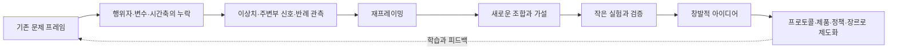
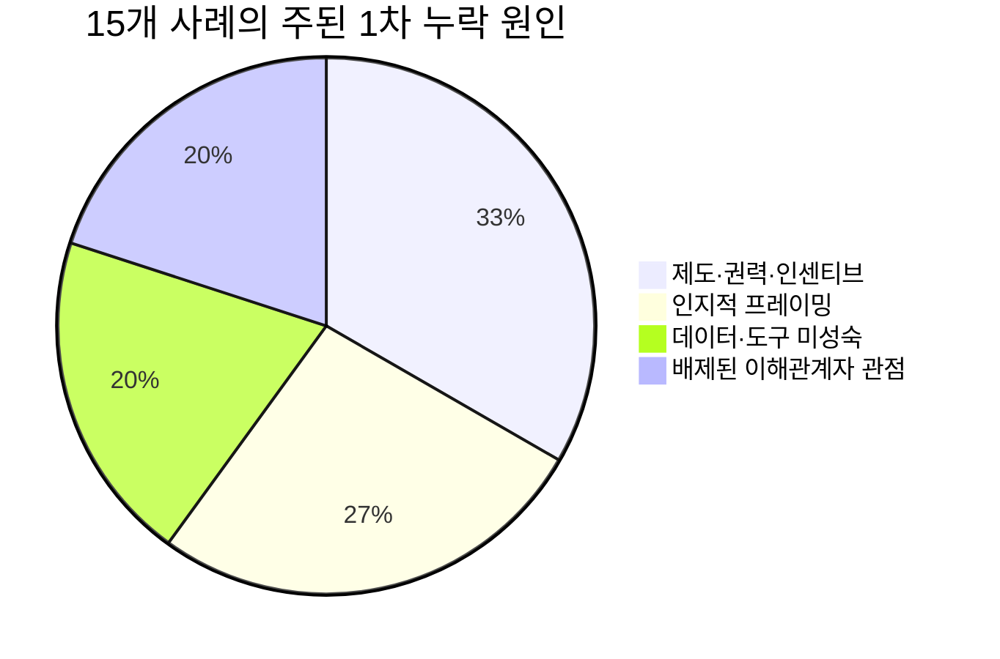
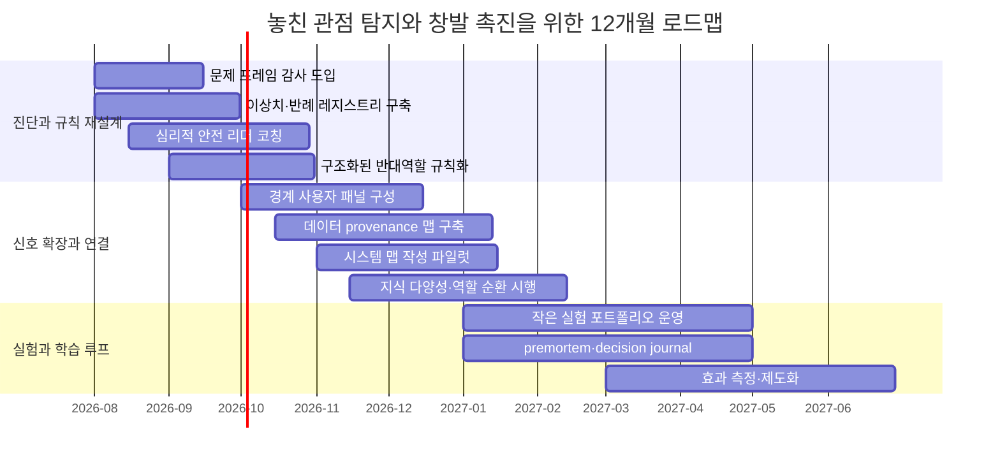

# 인류가 놓친 관점에서 창발로 가는 길

## 경영진 요약

이 보고서는 사용자가 제시한 표현인 **‘놓친 관점(Missing point) → 창발적 아이디어(Ideation emergence)’**를, 학술적으로는 **경계가 설정된 인지·제도·데이터 체계가 어떤 변수·행위자·시간축·인과고리를 보지 못한 상태**와, 그 누락이 **재프레이밍·상호작용·실험·조합**을 거쳐 **질적으로 새로운 해결안**으로 전환되는 과정으로 해석했다. 엄밀히 말해 *missing point*는 단일 학술 표준용어라기보다 **bounded awareness**, **WYSIATI**, **problem framing/reframing**, **paradigm/anomaly**의 교차지점에 가까우며, *ideation emergence*는 복잡계의 **emergence**와 집단창의성의 **협업적 출현** 개념을 실무 혁신 문맥으로 번역한 개념이다. citeturn20search6turn20search0turn15search0turn20search7turn14search2turn24search0turn19search8turn27search5

역사·동시대 사례 15건을 비교한 결과, 돌파구는 대개 “더 많은 아이디어”에서 나오지 않았다. 오히려 **문제를 틀 짓는 방식이 바뀌는 순간** 시작됐다. 산욕열은 “불가피한 사망”이 아니라 “손을 통해 매개되는 감염”으로, 교통사고는 “개인의 실수”가 아니라 “인간 오류를 흡수하지 못한 시스템”으로, 가난은 “신용불량의 원인”이 아니라 “신용 접근이 배제된 결과”로 재정의될 때 아이디어가 비약적으로 바뀌었다. 이 전환은 과학, 기술, 공공정책, 예술, 비즈니스, 사회운동, 저널리즘 전반에서 반복되었다. citeturn2search5turn2search2turn0search0turn7search3turn6search4turn22search0turn22search2turn18search3turn3search10

본 보고서가 코딩한 15개 사례의 **주된 1차 누락 원인**은 대략 네 묶음으로 수렴했다. 첫째는 **제도·권력·인센티브의 경직성**, 둘째는 **인지적 프레이밍과 확증편향**, 셋째는 **배제된 사용자·주변부 집단의 관점 부재**, 넷째는 **데이터·도구·관측기술의 미성숙**이다. 중요한 것은 이 네 요인이 별개가 아니라는 점이다. 실제로는 “권위적 제도 + 빈약한 데이터 + 고착된 프레임”이 함께 작동할 때 놓친 관점이 장기화되었다. 반대로 창발적 아이디어는 **반례 포착, 주변부 신호의 제도화, 재프레이밍, 작은 실험, 증거 삼각측량**이 결합될 때 나타났다. citeturn19search6turn20search6turn15search2turn19search8turn30search0turn30search4

따라서 조직과 연구팀이 해야 할 일은 “천재를 기다리는 것”이 아니라, **놓친 관점을 발견하는 운영체계**를 만드는 것이다. 이 보고서는 이를 위해 문제 프레임 감사, 이상치·반례 레지스트리, 심리적 안전, 구조화된 반대역할, 현장·경계 사용자 참여, 데이터 provenance 맵, 실험 포트폴리오, 시간축 기반 의사결정 점검, 지식 다양성 설계, 시스템 맵핑의 10개 개입 전략을 제안한다. 자료는 노벨재단, WHO, CDC, USGS, NASA, UNEP, Toyota, ICIJ, MoMA, KCI, 한국장애인개발원 등 1차·공식 출처를 우선했고, 대화에 첨부된 기존 문서는 배경 맥락 확인용으로만 참조했다. citeturn1search1turn6search4turn0search0turn12search0turn13search12turn21search1turn9search0turn3search10turn4search0turn17search0turn29search7turn30search0 fileciteturn0file0

## 개념 정의와 분석틀

‘놓친 관점’은 엄밀한 단일 학술 용어는 아니지만, 연구적으로는 **인지적·제도적 프레임이 실제 문제에 중요한 정보, 행위자, 변수, 시간범위, 혹은 인과관계를 체계적으로 제외한 상태**로 정의할 수 있다. Bazerman 계열의 **bounded awareness**는 사람들이 주변에 “이미 있는” 중요 정보를 보지 못하거나 찾지 못하는 경향을 설명하고, Kahneman의 **WYSIATI**는 *보이는 것이 전부인 양* 너무 성급하게 이야기 구조를 완성하는 편향을 설명한다. 디자인 연구에서는 이것이 **problem framing/reframing**의 문제로, 과학철학에서는 **기존 패러다임이 이상(anomaly)을 오랫동안 주변화하는 문제**로 나타난다. 한국어 연구에서도 문제설정(problem posing)과 창의적 문제해결은 단순한 해답 산출 이전에 **무엇을 문제로 볼 것인가**를 다시 구성하는 과정으로 다뤄진다. citeturn20search6turn20search0turn15search0turn20search7turn14search2turn17search0turn17search2

실무적으로 번역하면, 놓친 관점은 “회의실 안에서는 보이지 않지만 현장·사용자·경계조건·시간지연·외부성에서 결정적 영향을 미치는 요소”다. 그래서 이것은 정보 부족만의 문제가 아니다. 권위, 조직문화, 평가 지표, 전문직 정체성, 규범, 침묵 비용이 모두 관여한다. *무엇을 측정하느냐*뿐 아니라 *누가 말할 수 있느냐*, *어떤 이상치가 정식 의제로 등록되느냐*가 동시에 중요하다. citeturn19search5turn30search0turn20search6turn15search1

‘창발적 아이디어’는 학술적으로는 **개별 요소를 단순 합산해서는 설명되지 않는 질적 새로움**이 상호작용에서 나타나는 현상이다. 복잡계 연구는 창발을 “미시 수준 요소의 상호작용에서 거시 수준의 새로운 행동이 출현하는 현상”으로 설명하고, 집단창의성 연구는 협업적 창의성의 핵심 속성으로 **즉흥성, 상호작용, emergence**를 든다. 한국어 연구 역시 창발을 “예상치 못한 새로운 현상이 불현듯 출현하는 것”으로 설명한다. 따라서 이 보고서에서의 창발적 아이디어란, 단순한 브레인스토밍 산출물이 아니라 **문제 프레임의 수정, 상호작용의 재배열, 실험의 피드백**을 거치며 나타나는 새로운 해결 조합을 뜻한다. citeturn19search8turn19search0turn24search0turn24search1turn27search5

실무적으로는 **이전에는 해답 후보로 간주되지 않았던 조합이, 새로운 관점의 채택 이후 갑자기 실행 가능한 해법으로 보이기 시작하는 순간**이 창발이다. 예컨대 “병원 청결”이 아니라 “손위생 프로토콜”, “차량 안전”이 아니라 “인간 오류를 전제로 한 도로 시스템”, “기자 개인의 특종”이 아니라 “초국경 데이터 협업 네트워크”로 전환되는 순간이다. 즉 창발은 무(無)에서 나오는 번뜩임이 아니라, **보지 못한 관계를 보게 되었을 때** 발생하는 재구성 효과다. citeturn2search5turn7search3turn3search10turn24search8

아래 도식은 본 보고서의 핵심 메커니즘을 요약한 것이다. 사례 전반에서 반복된 구조는 “기존 프레임 → 관점 누락 → 반례/주변부 신호 포착 → 재프레이밍 → 실험과 조합 → 창발 → 제도화”였다. citeturn15search2turn20search6turn19search8turn24search0

다음 표는 보고서 전체에서 사용할 두 핵심 개념의 정리다. citeturn20search6turn15search0turn24search0turn27search5turn17search0

| 개념 | 학술적 정의 | 실무적 정의 | 분석상 핵심 질문 | 근거 |
|---|---|---|---|---|
| 놓친 관점 | 인지·제도·패러다임이 중요한 정보·행위자·인과를 제외한 상태 | 조직이 계속 의사결정을 하지만 정작 중요한 신호는 공식적으로 보지 않는 상태 | 무엇이 프레임 밖으로 밀려나 있는가? 누가 말하지 못하는가? | citeturn20search6turn20search0turn15search0turn14search2turn17search0 |
| 창발적 아이디어 | 상호작용에서 질적으로 새로운 해결 구성이 출현하는 현상 | 재프레이밍 이후 갑자기 “실행 가능한 해법”으로 보이기 시작하는 새 조합 | 어떤 상호작용이 새 조합을 가능하게 했는가? 어떤 실험이 이를 고정했는가? | citeturn19search8turn19search0turn24search0turn27search5 |

## 사례 비교

아래 표는 과학, 기술, 공공정책, 예술, 비즈니스, 사회운동, 저널리즘에 걸친 15개 사례를 비교한 것이다. 표의 “왜 놓쳤나” 항목은 단순 사실 인용이 아니라, 각 사례의 1차 자료와 행동과학·조직이론 문헌을 함께 읽어 **인지 편향, 제도 요인, 데이터 공백**으로 분석한 결과다. citeturn20search6turn19search6turn15search2turn30search0

| 사례 | 분야·시기 | 맥락 | 놓친 관점 | 왜 놓쳤나 | 나중에 어떻게 발견되었나 | 창발적 아이디어·결과 | 주요 근거 |
|---|---|---|---|---|---|---|---|
| 이그나츠 제멜바이스와 손위생 | 과학·의학, 1840s | 빈 산부인과에서 산욕열 사망률이 매우 높았음 | “의사와 학생의 손”이 감염 매개체라는 관점 | 세균이론 부재, 의학 권위에 대한 위협, 기존 관행의 자기정당화 | 부검실을 거친 의학생 집단과 그렇지 않은 집단의 사망률 차이를 비교하고, 염소석회 손씻기 도입 후 사망률이 급감함 | 병원 감염관리와 손위생 프로토콜의 출발점 | citeturn2search5turn2search2turn2search6 |
| 존 스노와 브로드 스트리트 펌프 | 공공정책·역학, 1854 | 런던 콜레라 유행 당시 장기지배적 설명은 미아즈마였음 | 질병을 “공기”가 아니라 “오염된 물 공급망”으로 보는 관점 | 지배적 패러다임 고착, 환경·공간 데이터 부재, 정책결정의 보수성 | 사망자의 위치와 우물 이용 패턴을 지도화하고 인터뷰를 통해 공통요인을 확인함 | 현대 역학, 데이터 지도화, 근거기반 위생정책 | citeturn0search0turn0search6turn0search4 |
| 베게너에서 판구조론으로 | 과학·지구과학, 1910s–1960s | 대륙 윤곽과 화석 분포의 일치가 있었지만 주류는 대륙 이동을 거부함 | 대륙·해저를 하나의 동적 시스템으로 보는 관점 | 이동 메커니즘 부재, 해저 데이터 부족, 학제 간 연결 약함 | 해저확장, 중양해령, 해양지각 연령 자료가 축적되며 메커니즘이 제시됨 | 판구조론이라는 통합 이론, 지질현상의 재해석 | citeturn12search5turn28search2turn28search3turn12search0 |
| 헬리코박터 파일로리와 소화성 궤양 | 과학·의학, 1980s–2000s | 궤양은 주로 스트레스·산 과다로 이해되었음 | “위에서도 박테리아가 병인을 형성할 수 있다”는 관점 | “위에서는 아무것도 자라지 않는다”는 교과서적 도그마, 전문직 정체성 위협 | Warren과 Marshall이 균을 관찰·배양하고, 제균 시 재발이 드물다는 근거를 축적함 | 항생제 중심의 근치 치료, 만성질환 프레임 전환 | citeturn1search1turn1search6turn1search7 |
| CRISPR의 전환 | 과학·생명공학, 1990s–2010s | 세균 유전체의 반복서열은 오랫동안 기이한 배열 정도로 여겨짐 | 반복서열을 “기능 없는 잡음”이 아니라 “적응면역 체계”로 보는 관점 | 기능 해석 도구와 맥락 부족, 미생물 관찰의 분절성 | CRISPR/Cas가 외래 DNA를 절단하는 면역 시스템임이 입증되고, 이후 2012년에 범용 유전자 가위로 단순화됨 | 정밀 유전체 편집, 생명과학 연구·치료법 혁신 | citeturn10search4turn11search1turn11search2 |
| 다층 신경망과 역전파 | 기술·컴퓨팅, 1980s–2010s | 초기 신경망은 단층 퍼셉트론 한계로 과소평가됨 | “숨은 층이 유용한 중간표현을 학습한다”는 관점 | 계산자원 부족, 단순 모델 편향, 표현학습 개념의 미성숙 | 1986년 역전파 논문이 hidden units의 표현학습을 명시했고, 이후 데이터·연산 증가로 성능이 폭발함 | 딥러닝 패러다임, 음성·시각·언어 처리 혁신 | citeturn8search1turn8search0turn8search2 |
| 챌린저호 O-ring | 기술·항공우주, 1986 | 발사 전 저온이 고체로켓 O-ring 봉합성에 미칠 영향이 제기되었음 | “사소한 기계 부품의 온도 민감성”이 시스템 실패를 일으킬 수 있다는 관점 | 일정 압박, 위계적 의사결정, 엔지니어 우려의 무력화, 그룹사고 | 로저스 위원회가 저온과 O-ring 경도·복원성 관련 자료와 사전 우려 문서를 검토함 | 안전문화 개편, 리스크 커뮤니케이션과 발사 승인 절차 재설계 | citeturn13search12turn13search6turn13search0 |
| 도요타 생산방식 | 비즈니스·운영, 1940s–1980s | 대량생산은 규모의 경제를 극대화했지만 재고·불량·병목을 키웠음 | 성과를 “총산출량”이 아니라 ‘무라·무리·무다’ 제거와 현장 신호로 보는 관점 | 배치효율 편향, 현장지식 경시, 결함 은폐 문화 | 반복 실험과 현장 개선을 통해 Just-in-Time, jidoka, andon 체계를 정착시킴 | 린 생산, 품질 내재화, 현장 문제노출형 혁신 | citeturn9search0turn9search2 |
| 무함마드 유누스와 그라민은행 | 비즈니스·사회혁신, 1970s–2000s | 전통 은행은 가난한 사람을 담보와 신용이 없는 비대상으로 간주함 | “가난한 사람도 소액·무담보 신용의 유효한 상환자”라는 관점 | 계급적 가정, 제도 설계의 배제, 기존 금융모형의 경직성 | 유누스가 자비로 소액대출 실험을 하고 상환행동을 관찰함 | 마이크로크레디트, 사회적 기업가정신, 금융포용 | citeturn22search0turn22search2turn22search6 |
| 오존홀과 몬트리올 의정서 | 공공정책·환경, 1980s | CFC는 오랫동안 생활 편익 중심으로 평가되었고 대기권 외부효과는 과소가시화됨 | 성층권 화학과 인간활동을 연결하는 지구시스템 관점 | 산업계 회의론, 과학 불확실성, 지연된 관측 신호 | 1985년 남극 오존홀 발견과 후속 검증이 정책 전환을 촉발함 | 과학-정책 적응형 글로벌 거버넌스, ODS 단계적 퇴출 | citeturn21search4turn21search1turn21search6 |
| 비전 제로 | 공공정책·교통안전, 1997–현재 | 전통적 교통안전은 사고를 주로 개인 운전자 책임으로 다룸 | “인간은 오류를 내므로 시스템이 충격을 흡수해야 한다”는 관점 | 개인책임 프레임, 비용편익 중심 판단, 부문 분절 | 스웨덴이 윤리적 목표로 ‘사망·중상 0’을 채택하고 WHO가 safe system 접근을 확산 | 도로·차량·속도·사용자 전체를 재설계하는 시스템 안전정책 | citeturn7search3turn6search4turn6search2 |
| 존 케이지의 4'33" | 예술·음악, 1952 | 전통음악은 의도된 음만 ‘작품’으로 취급함 | 침묵과 환경음, 청중의 소리도 음악 경험의 일부라는 관점 | 장르 관습, 청취 규범의 고착, 예술의 위계 | 초연에서 피아노 연주 대신 세 악장의 침묵을 제시하며 청중의 환경음을 노출시킴 | 우연성·환경음·개념예술을 여는 급진적 재프레이밍 | citeturn4search0turn4search1turn4search7 |
| 장애인권 운동과 유니버설디자인 | 사회운동·디자인·정책, 1970s–현재 | 도시와 건축은 사실상 비장애인 몸을 ‘표준 사용자’로 설계함 | 접근성은 특혜가 아니라 기본 설계 조건이라는 관점 | 사용자 배제, 실행규정 부재, 비용 회피 | 504 시위, ADA, 접근성 표준과 커브컷·램프·정보접근 규칙이 제도화됨 | 유니버설디자인, 포용적 설계, ‘커브컷 효과’의 확산 | citeturn5search0turn5search5turn5search7turn29search7 |
| #MeToo 운동 | 사회운동, 2006·2017–현재 | 성폭력과 괴롭힘은 오랫동안 개별·사적 사건처럼 다뤄짐 | 피해 경험의 누적은 ‘예외’가 아니라 구조적 패턴이라는 관점 | 낙인, 보복 두려움, 신고 인프라 부재, 증언의 단절 | Tarana Burke의 운동이 2017년 해시태그 확산과 함께 대규모 집단 증언으로 연결됨 | survivor-centered 프레임, 집단증언 기반 문화·정책 전환 | citeturn18search3turn18search4turn18search8 |
| 파나마 페이퍼스 | 저널리즘, 2016 | 역외금융과 조세회피는 각국별·사건별로 단편 보도되기 쉬웠음 | 문제를 ‘개별 비리’가 아니라 ‘초국경 네트워크 데이터 구조’로 보는 관점 | 국가·언론사 사일로, 데이터 규모 과부하, 협업 인센티브 부족 | 독일 매체가 자료를 ICIJ와 공유하고 100여 개 언론, 370명 이상 기자가 협업함 | 협업형 데이터 저널리즘, 네트워크 탐사보도의 표준화 | citeturn3search10turn3search5turn3search3 |

## 반복 패턴과 근본 원인

위 15개 사례를 **주된 1차 누락 원인**으로 단일 분류해 보면, 제도·권력·인센티브 문제가 5건, 인지적 프레이밍 문제가 4건, 데이터·도구 미성숙이 3건, 배제된 이해관계자 관점 부재가 3건이었다. 이는 “아이디어 부족”보다 **문제를 보는 렌즈와 신호를 공식화하는 제도**가 더 큰 병목임을 시사한다. 물론 실제 사례는 다중원인적이다. 다만 탐색적 코딩에서도 제도·인지·데이터·대표성의 네 축이 반복된다는 점은 분명했다. citeturn20search6turn19search6turn15search2turn30search0turn2search5turn13search12turn21search4turn5search0turn3search10

아래 차트는 그 탐색적 코딩 결과를 시각화한 것이다. 이 비율은 통계적 일반화가 아니라 **본 보고서 사례군에 대한 분석적 요약**이다. citeturn20search6turn19search8turn30search4

더 중요한 것은 각 범주가 실제 조직에서 어떻게 나타나는가이다. 아래 표는 사례군과 문헌을 연결해 **재발 메커니즘**을 정리한 것이다. citeturn20search6turn19search6turn30search0turn19search8

| 근본 원인 축 | 반복 메커니즘 | 대표 사례 | 무엇을 낳는가 | 시사점 | 근거 |
|---|---|---|---|---|---|
| 인지적 | WYSIATI, 프레임 고착, 기존 설명의 자기강화 | 존 스노 이전 미아즈마, 비전 제로 이전 개인책임 프레임, 존 케이지 이전 음악 규범 | 반례의 주변화, 문제정의의 축소 | “해답 회의”보다 “문제정의 회의”를 먼저 설계해야 함 | citeturn20search0turn15search2turn0search0turn7search3turn4search1 |
| 사회·문화 | 침묵 비용, 낙인, 전문직 정체성 위협, 주변부 증언의 비가시화 | 제멜바이스, #MeToo, 장애인권 운동 | 공식 의사결정에서 현장 신호 소실 | 말할 수 있는 구조와 보호장치가 창발의 전제 | citeturn2search2turn18search3turn5search0turn30search0 |
| 제도적 | 일정 압박, 성과지표 왜곡, 사일로, 반대의견 무력화 | 챌린저, 몬트리올 이전 산업 대응, 파나마 페이퍼스 이전 국별·매체별 분절 | 경보가 올라와도 행동으로 전환되지 않음 | dissent channel과 cross-silo coordination을 제도화해야 함 | citeturn13search12turn21search4turn3search10turn19search5 |
| 기술·데이터 | 관측도구 부족, 데이터 통합 미비, 상호작용 모델 부재 | 판구조론 이전 해저 데이터 부족, CRISPR 초기 반복서열 해석 부재, 저널리즘의 대규모 데이터 처리 한계 | 핵심 관계를 보지 못하거나 보더라도 검증 불가 | 데이터 provenance와 시스템 맵이 필요 | citeturn12search0turn28search3turn10search4turn3search3turn19search8 |

이 표가 말하는 핵심은 간단하다. **놓친 관점은 대개 누군가가 몰라서가 아니라, 알려져 있거나 보일 수 있는 신호가 의사결정 구조 안으로 들어오지 못해서 발생한다.** 그래서 해법도 개인의 통찰력 훈련만으로는 부족하다. 발견의 장치와 발화의 장치, 검증의 장치가 함께 있어야 한다. citeturn20search6turn30search0turn19search8

## 개입 전략과 실행 설계

사례와 문헌을 종합하면, 놓친 관점을 수면 위로 올리고 창발적 아이디어를 촉진하는 개입은 **탐지**, **재프레이밍**, **상호작용 설계**, **실험**, **제도화**의 다섯 층에 나뉜다. 아래의 10개 전략은 연구팀, 공공조직, 기업의 혁신조직 모두에 적용 가능하도록 설계했다. citeturn15search0turn20search6turn24search0turn30search0turn19search8

| 전략 | 실행 단계 | 필요한 자원 | 주요 위험 | 측정 지표 | 근거 |
|---|---|---|---|---|---|
| 문제 프레임 감사 | 모든 핵심 과제에 대해 “현재 프레임이 제외하는 행위자·시간축·외부성은 무엇인가?”를 체크리스트로 점검; 분기마다 재프레이밍 워크숍 운영 | 퍼실리테이터, 2~3시간 워크숍, 프레임 캔버스 | 형식적 행사로 전락 가능 | 재정의된 문제문 수, 재프레이밍 후 채택된 과제 비율 | citeturn15search0turn20search7turn17search0 |
| 이상치·반례 레지스트리 | 실패사례·예외값·현장 불만·비정상 로그를 “삭제”하지 말고 별도 저장; 월 1회 이상 anomaly review 개최 | 데이터 관리자, 공용 레포지토리, 리뷰 시간 | 잡음 과잉으로 집중력 저하 | 등록된 반례 수, 반례로 시작된 프로젝트 수, 해결 리드타임 | citeturn14search2turn0search4turn1search1 |
| 경계 사용자 참여 | 고객 평균이 아니라 소외 사용자, 예외 사용자, 극단 사용자, 실패 사용자로 자문패널 구성; 설계 초기에 참여 | 리쿠르팅 예산, 사용자 연구자, 보상 체계 | 토큰 참여, 대표성 착시 | 참여한 경계 사용자 수, 요구사항 반영률, 접근성 이슈 감소율 | citeturn5search0turn29search7turn15search2 |
| 구조화된 반대역할 | 중요한 결정마다 red team 또는 rotating dissenter 지정; 리더는 자신의 선호를 처음에는 밝히지 않음 | 회의 규칙, 역할 로테이션, 기록자 | 대립의례화, 방어적 분위기 | 대안 시나리오 수, 리더 사전선호 비공개 준수율, 의사결정 수정률 | citeturn19search5turn19search4turn13search12 |
| 심리적 안전 구축 | 오류 공유와 질문을 인사상 불이익과 분리; 회의 시작 시 “반대·질문 환영” 명시; 리더 코칭 시행 | 리더 교육, 설문도구, 익명 피드백 채널 | 선언만 있고 실제 보상체계가 안 바뀔 위험 | 심리적 안전 점수, 발언 분산도, 오류 보고 건수 | citeturn30search0turn30search5 |
| 증거 삼각측량과 provenance 맵 | 결론마다 데이터 출처, 수집 경로, 누락 집단, 가정치 표시; 숫자·서사·현장 관찰을 함께 검토 | 데이터 엔지니어, 정책분석가, 리서치 템플릿 | 분석 과부하, 의사결정 지연 | 출처 다양성 지수, provenance 명시율, 재현성 점검 통과율 | citeturn3search10turn21search1turn19search8 |
| 작은 실험 포트폴리오 | 거대 승인 전에 2~6주 규모의 저비용 실험 실행; 가설·중단 기준·학습 포인트를 사전 정의 | 실험 예산, 실험 설계자, 샌드박스 환경 | 실험 남발, 국지 최적화 | 실험 사이클 타임, 가설 검증률, 피벗 비율, 학습 문서화율 | citeturn15search1turn15search2turn9search2 |
| 시간축 기반 의사결정 점검 | premortem, postmortem, decision journal을 결합해 사전·사후 학습 연결 | 회의 60~90분, 템플릿, 리뷰 책임자 | premortem만 하고 사후 학습이 부재할 위험 | 예측-결과 오차, 재발 리스크 감소율, 사후 학습 반영률 | citeturn30search2turn20search0 |
| 지식 다양성·역할 순환 | 동일 전공·부서 고정팀 대신 역할 교차, 외부 전문가 단기 합류, 지식 브리지 역할 배치 | 협업 예산, 역할 매트릭스, 외부 네트워크 | 갈등 증가, 조정 비용 상승 | 배경 다양성 지수, 교차부서 협업 수, 신규 조합 아이디어 수 | citeturn24search8turn30search4turn30search7 |
| 시스템 맵과 상호작용 시각화 | 문제를 단일 KPI가 아니라 인과지도·이해관계자 지도·피드백 루프로 모델링 | 시스템 사고 퍼실리테이터, 시각화 툴 | 지도가 복잡해져 실행이 멈출 위험 | 작성된 시스템 맵 수, 피드백 루프 식별 수, 부작용 감소율 | citeturn19search8turn19search0turn6search4 |

이 10개 중 조직이 가장 먼저 도입해야 할 것은 **문제 프레임 감사**, **이상치 레지스트리**, **심리적 안전**, **구조화된 반대역할**이다. 이유는 간단하다. 이 네 가지가 없으면 나머지 전략은 정보를 더 모으기만 하고, 정작 프레임을 바꾸지 못한 채 기존 결론을 더 강하게 합리화할 가능성이 크기 때문이다. 특히 챌린저, 제멜바이스, #MeToo 사례는 “증거가 전혀 없어서”가 아니라 **증거가 말해질 수 없거나 의제로 격상되지 못해서** 실패했다는 점을 보여 준다. citeturn13search12turn2search2turn18search3turn30search0turn19search6

반면 중기적으로 효과가 큰 것은 **경계 사용자 참여**, **증거 삼각측량**, **작은 실험 포트폴리오**, **시스템 맵**이다. 이는 놓친 관점을 “발견”하는 것에서 “검증 가능한 새 조합으로 전환”하는 단계에 해당한다. 비전 제로, 유니버설디자인, 파나마 페이퍼스는 이 중기 전략이 왜 필요한지를 잘 보여 준다. 안전, 접근성, 조세회피 모두 개별 사건을 모아도 해결되지 않았고, **시스템 전체를 다시 연결해 볼 때** 비로소 해결 원리가 보였다. citeturn7search3turn29search7turn3search10turn19search8

## 적용 로드맵

아래 로드맵은 조직이나 연구팀이 12개월 동안 위의 개입전략을 정착시키는 우선순위 제안이다. 시작일은 사용자의 현재 시점에 맞춰 **2026년 8월**로 두었다. 핵심 원리는 “먼저 발화와 탐지의 구조를 바꾸고, 다음에 데이터와 참여 구조를 넓히며, 마지막에 실험과 제도화를 확장한다”는 순서다. 이는 그룹사고·심리적 안전·재프레이밍·시스템적 창발 연구와 사례군 비교 결과를 반영한 것이다. citeturn19search5turn30search0turn15search0turn19search8

우선순위를 짧게 정리하면 이렇다. **초기 단계**는 프레임과 침묵을 다루고, **중간 단계**는 다양한 신호를 연결하며, **후기 단계**는 학습 루프를 제도화한다. 즉, 초기에 데이터 플랫폼부터 대규모로 만들기보다, 먼저 **무엇을 놓치고 있는지 말할 수 있는 체계**를 만들어야 한다. 그렇지 않으면 새 도구가 기존 편향을 더 정교하게 만들 뿐이다. citeturn20search6turn30search0turn19search8

실행 우선순위를 조금 더 구체화한 표는 다음과 같다. citeturn30search0turn15search2turn19search6

| 단계 | 우선 과제 | 기대 효과 | 성공 기준 | 근거 |
|---|---|---|---|---|
| 초기 | 프레임 감사, 이상치 레지스트리, 심리적 안전, 반대역할 | 숨은 신호가 공식 의제로 들어오기 시작함 | “반대·질문·예외”가 회의록과 의사결정 문서에 남기 시작함 | citeturn20search6turn30search0turn19search5 |
| 중기 | 경계 사용자 패널, provenance 맵, 시스템 맵, 지식 다양성 설계 | 기존 KPI 바깥의 인과 연결과 사용자 관점 가시화 | 새롭게 식별된 변수·이해관계자·피드백 루프 수가 증가함 | citeturn29search7turn19search8turn30search4 |
| 후기 | 실험 포트폴리오, premortem/postmortem, 성과 제도화 | 재프레이밍이 아이디어를 넘어 프로토콜과 제품으로 전환 | 실험-피벗-학습 루프가 분기 성과관리 체계와 연결됨 | citeturn30search2turn15search1turn15search2 |

조직 차원의 최종 KPI는 단순 매출이나 논문 수만으로 잡으면 안 된다. **재정의된 문제문 수, 반례 기반 프로젝트 비율, 외부 사용자 관점 반영률, 심리적 안전 점수, 대안 시나리오 수, 실험 회전속도, provenance 명시율** 같은 선행지표가 필요하다. 그래야 창발을 “결과가 나왔을 때만 사후적으로 칭찬하는 것”이 아니라, **발생 조건을 관리하는 것**으로 바꿀 수 있다. citeturn30search0turn19search8turn15search2

## 결론

인류가 자주 놓친 것은 “해답”이 아니라 **문제의 진짜 경계**였다. 미생물, 오염수, 판운동, 위 박테리아, 반복서열, hidden units, 작은 O-ring, 공정의 낭비, 가난한 차입자, 성층권 화학, 인간 오류, 침묵의 음악, 휠체어 사용자, 집단 증언, 역외금융 네트워크는 각각 다른 대상처럼 보이지만, 공통점이 있다. 모두 한 시점에는 **주류 프레임 밖**에 있었다는 점이다. citeturn2search5turn0search0turn12search0turn1search1turn10search4turn8search1turn13search12turn9search0turn22search0turn21search1turn7search3turn4search1turn5search0turn18search3turn3search10

따라서 ‘Missing point → Ideation 창발’은 신비로운 번뜩임의 서사가 아니다. 그것은 **누락을 감지하는 제도**, **발화가 가능한 문화**, **재프레이밍을 허용하는 리더십**, **작게 실험하는 운영방식**, **다양한 행위자와 증거를 연결하는 구조**가 있을 때 재현 가능성이 높아지는 현상이다. 이 보고서의 15개 사례는 창발이 우연히 일어날 수는 있어도, **우연에만 맡길 필요는 없다**는 사실을 보여 준다. 놓친 관점을 포착하는 체계를 만들면, 창발은 더 자주, 더 빠르게, 더 안전하게 일어날 수 있다. citeturn20search6turn15search0turn24search0turn30search0turn19search8