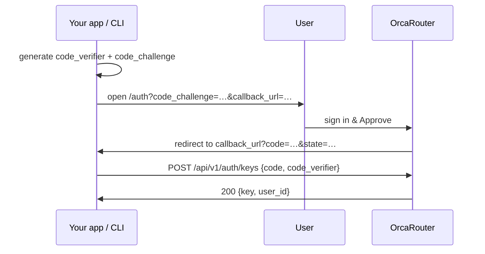

> ## Documentation Index
> Fetch the complete documentation index at: https://docs.orcarouter.ai/llms.txt
> Use this file to discover all available pages before exploring further.

# Sign in with OrcaRouter (PKCE)

> Let your app obtain an OrcaRouter API key for a user via OAuth 2.0 + PKCE — no manual copy-paste.

If you build a CLI or app that talks to OrcaRouter on a user's behalf, you can
add a **"Sign in with OrcaRouter"** button instead of asking users to paste an
API key. The user approves your app on OrcaRouter, and your app receives a
freshly-minted `sk-orca-...` key scoped to that user.

The flow is a standard **OAuth 2.0 Authorization Code grant with PKCE**
([RFC 7636](https://www.rfc-editor.org/rfc/rfc7636)). It mirrors OpenRouter's
`/api/v1/auth/keys` flow, so most existing OpenRouter PKCE client libraries work
against OrcaRouter with only a base-URL change.

<Info>
  **At a glance**

  * **Discover endpoints** at `GET /.well-known/openid-configuration` — always read them from there rather than hard-coding.
  * **PKCE methods:** `S256` (recommended) and `plain`.
  * **Authorization codes** are single-use and expire after **10 minutes**.
  * **Rate limit:** a user can authorize at most **10 keys per 24 hours**.
  * **No client secret** — the token endpoint uses `token_endpoint_auth_methods_supported: ["none"]`. The `code_verifier` is your only proof.
</Info>

## Flow overview



## 1. Generate a code verifier and challenge

Create a random `code_verifier` (43–128 characters from the unreserved set
`A-Z a-z 0-9 - . _ ~`), then derive the `code_challenge` as the base64url-encoded
SHA-256 of the verifier (no padding). Keep the verifier in memory — you'll need
it again in step 4.

<CodeGroup>
  ```js JavaScript theme={null}
  function base64url(bytes) {
    return btoa(String.fromCharCode(...bytes))
      .replace(/\+/g, '-')
      .replace(/\//g, '_')
      .replace(/=+$/, '');
  }

  const verifier = base64url(crypto.getRandomValues(new Uint8Array(32)));
  const digest = await crypto.subtle.digest(
    'SHA-256',
    new TextEncoder().encode(verifier),
  );
  const challenge = base64url(new Uint8Array(digest));
  ```

  ```python Python theme={null}
  import base64, hashlib, secrets

  verifier = base64.urlsafe_b64encode(secrets.token_bytes(32)).rstrip(b"=").decode()
  challenge = (
      base64.urlsafe_b64encode(hashlib.sha256(verifier.encode()).digest())
      .rstrip(b"=")
      .decode()
  )
  ```
</CodeGroup>

<Note>
  `plain` (where `code_challenge == code_verifier`) is also accepted, but always
  prefer `S256` — with `plain` the challenge and verifier are identical, so it
  offers no protection if the authorization code leaks.
</Note>

## 2. Redirect the user to the authorization page

Open the OrcaRouter authorization page in the user's browser with your challenge
and callback:

```
https://www.orcarouter.ai/auth
  ?callback_url=https://app.example.com/callback
  &code_challenge=<challenge>
  &code_challenge_method=S256
  &state=<random-opaque-string>
  &app_name=My%20App
  &scope=api
```

| Parameter               | Required    | Notes                                                                                                                                                                                  |
| ----------------------- | ----------- | -------------------------------------------------------------------------------------------------------------------------------------------------------------------------------------- |
| `callback_url`          | ✅           | Where OrcaRouter redirects after approval. **https** on any host; **http only on loopback** (`localhost`, `127.0.0.0/8`, `::1`) for local dev. Must not contain a URL fragment (`#…`). |
| `code_challenge`        | ✅           | From step 1. Max 128 chars.                                                                                                                                                            |
| `code_challenge_method` | ✅           | `S256` (recommended) or `plain`.                                                                                                                                                       |
| `state`                 | Recommended | Opaque value echoed back on the callback. Generate it randomly per request and verify it on return to defend against CSRF.                                                             |
| `app_name`              | Recommended | Shown on the consent screen so the user knows who is asking. Also the key used later to revoke this app.                                                                               |
| `scope`                 | Optional    | Only `api` is supported today; defaults to `api`.                                                                                                                                      |
| `login_hint`            | Optional    | Pre-fills the email on the sign-in form.                                                                                                                                               |

The user signs in (if needed) and sees a consent screen naming your app and the
callback host. On **Approve**, OrcaRouter redirects to your `callback_url`.

<Note>
  Approving requires the user to have at least the **Developer** role in their
  active workspace. Members without that role won't be able to complete the grant.
</Note>

## 3. Receive the authorization code

On approval, OrcaRouter appends `code` and your `state` to the callback:

```
https://app.example.com/callback?code=<one-time-code>&state=<your-state>
```

If the user denies (or the request is malformed), OrcaRouter redirects with an
`error` parameter instead:

```
https://app.example.com/callback?error=access_denied&state=<your-state>
```

Verify that the returned `state` matches the value you sent before proceeding.

## 4. Exchange the code for an API key

`POST` the `code` and the original `code_verifier` to the token endpoint. Both
JSON and `application/x-www-form-urlencoded` bodies are accepted (form-encoded is
what standards-compliant OAuth libraries send).

<CodeGroup>
  ```bash cURL (JSON) theme={null}
  curl https://www.orcarouter.ai/api/v1/auth/keys \
    -H "Content-Type: application/json" \
    -d '{
      "code": "<one-time-code>",
      "code_verifier": "<verifier-from-step-1>"
    }'
  ```

  ```bash cURL (form-encoded) theme={null}
  curl https://www.orcarouter.ai/api/v1/auth/keys \
    -d "code=<one-time-code>" \
    -d "code_verifier=<verifier-from-step-1>"
  ```
</CodeGroup>

A successful exchange returns the minted key:

```json theme={null}
{
  "key": "sk-orca-...",
  "user_id": 123
}
```

<ResponseField name="key" type="string">
  The user's new API key. Store it securely — send it as
  `Authorization: Bearer sk-orca-...` on subsequent calls
  (see [Get an API key](/getting-started/get-api-key)).
</ResponseField>

<ResponseField name="user_id" type="integer">
  The OrcaRouter user ID the key belongs to.
</ResponseField>

<Warning>
  The `code_challenge_method` is optional at exchange time — OrcaRouter already
  knows the method from the authorization step. If you do send it, it must match
  what you sent in step 2, or the exchange is rejected.
</Warning>

## Discovery

Standard OAuth/OIDC clients can auto-configure from the discovery document
([RFC 8414](https://www.rfc-editor.org/rfc/rfc8414) shape):

```bash theme={null}
curl https://www.orcarouter.ai/.well-known/openid-configuration
```

```json theme={null}
{
  "issuer": "https://www.orcarouter.ai",
  "authorization_endpoint": "https://www.orcarouter.ai/auth",
  "token_endpoint": "https://www.orcarouter.ai/api/v1/auth/keys",
  "response_types_supported": ["code"],
  "grant_types_supported": ["authorization_code"],
  "code_challenge_methods_supported": ["S256", "plain"],
  "token_endpoint_auth_methods_supported": ["none"]
}
```

Read your endpoints from this document rather than hard-coding them — it always
reflects the correct host for the deployment you're talking to.

## Errors

The token endpoint (`/api/v1/auth/keys`) follows the OpenRouter contract:

| Status | Meaning                                                                                                                                                                                                        |
| ------ | -------------------------------------------------------------------------------------------------------------------------------------------------------------------------------------------------------------- |
| `200`  | Success — body contains `key` and `user_id`.                                                                                                                                                                   |
| `400`  | Malformed request: missing `code`, unparseable body, unknown `code_challenge_method`, or a method that doesn't match the authorization step.                                                                   |
| `403`  | `Invalid code or code_verifier` — the code is unknown, expired, already used, or the verifier doesn't satisfy the stored challenge. Errors are deliberately generic so they don't leak which condition failed. |

Codes are single-use: a second exchange of the same code returns `403`. If the
user hits the **10-keys-per-24h** cap, the failure surfaces on the consent screen
(HTTP `429`) during approval — before your app ever receives a code.

## Managing authorized apps

Each successful exchange mints a real API key the user can see and revoke under
**Authorized Apps** in their OrcaRouter account. When a key is issued, OrcaRouter
emails the user a notification (app name, callback host, and IP), so an
unexpected grant is easy to spot and revoke.

<Note>
  Keys minted through this flow behave like any other OrcaRouter key: they respect
  the account's balance and workspace rate limits. See
  [Get an API key](/getting-started/get-api-key) and
  [Rate Limits](/operations/rate-limits).
</Note>
